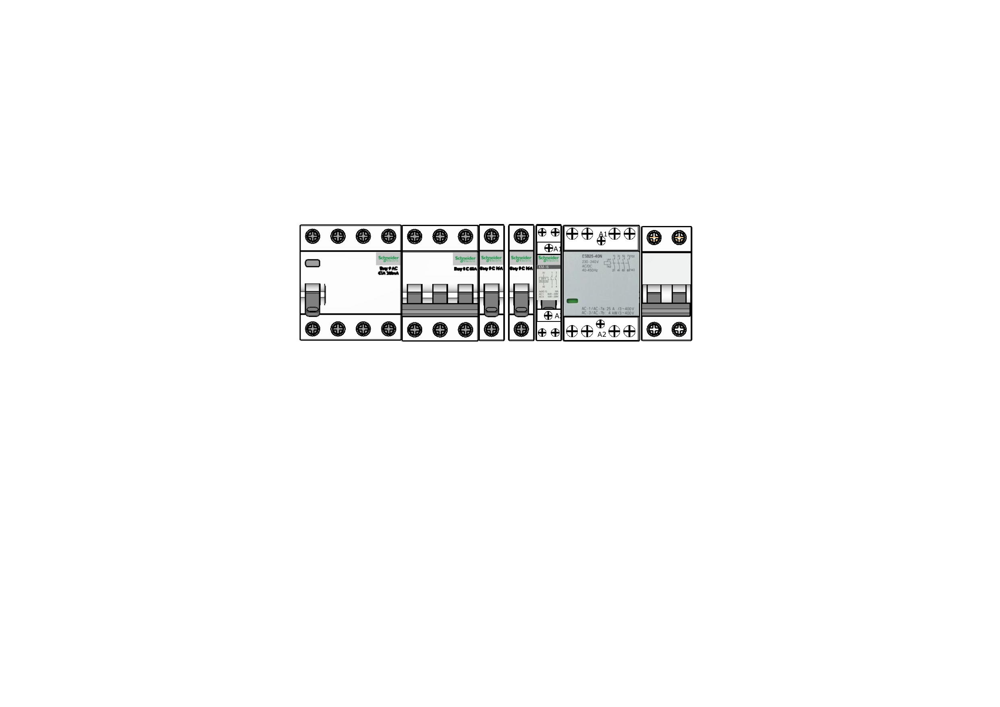
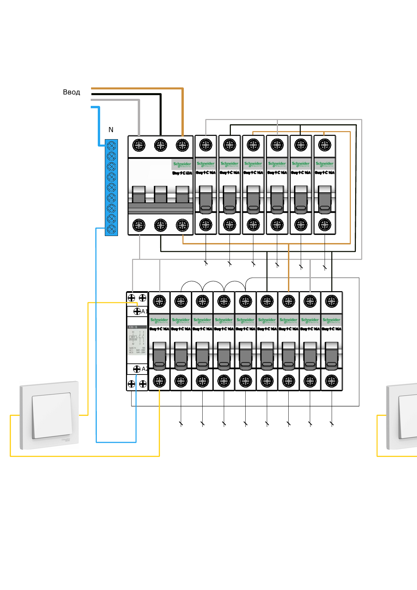
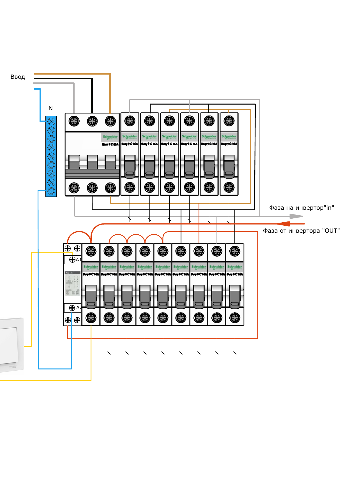
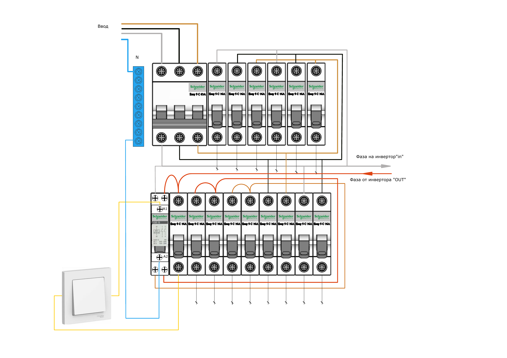
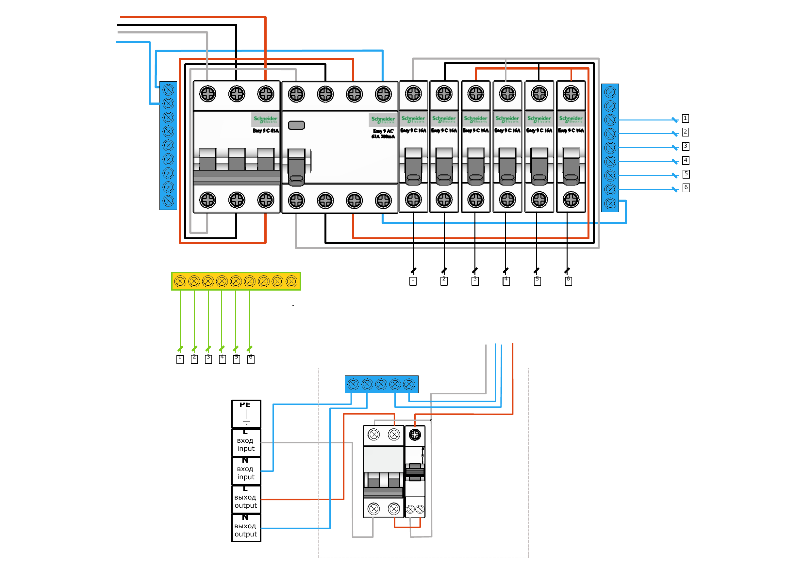
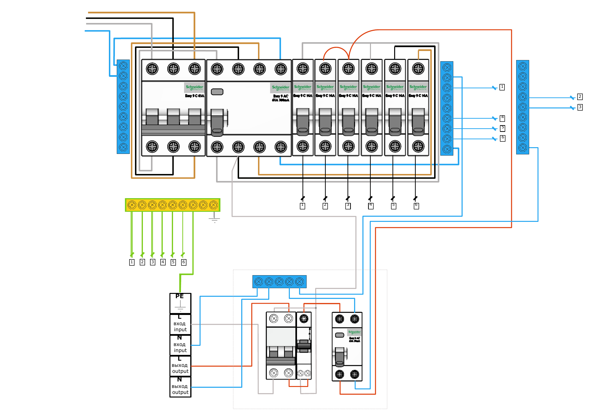
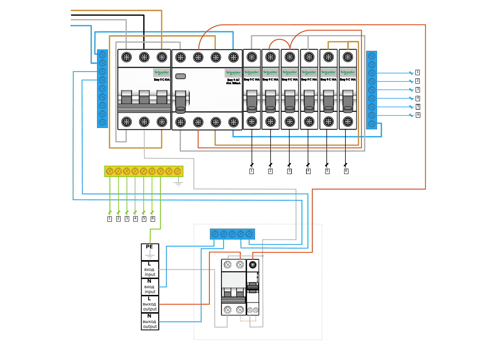

# doc_017 visual schemes review

Source:

- `doc_017`
- `ЭЛК_5 - Переборка щитов_1.0.docx`
- source format: `DOCX`
- topic: `Переборка щитов`

Purpose:

This file preserves the valuable visual schemes from `doc_017` as separate reviewable units. The descriptions below are primary visual descriptions, not canonical technical instructions.

Rules for review:

- Do not create source-backed statements from these schemes until a manual expert review confirms the exact meaning.
- Do not treat line color, terminal position, or crop boundary as sufficient evidence by itself.
- Any future wiring, terminal, inverter input/output, reserve-group, or shield-rework statement must use `risk_level = safety_critical` and `review_status = review_required`.
- These images are DOCX-derived scheme renders. They are not restored PDF-derived artifacts. They are linked in `statement_images.jsonl` only as `visual_review_candidate` / `review_required`, not as accepted visual evidence.

## `doc_017_scheme_001`

- Chunk: `doc_017_chunk_0001`
- Statement: `doc_017_chunk_0001_stmt_001`
- Image ID: `img_0123`
- File: `../../images/normalized/doc017_scheme_001_page_1_component_lineup.png`
- Status: `manual_review_required`

Primary description:

The visual unit shows a horizontal lineup of distribution-board components. A contactor-like module is visible near the right side, with labels `A1` and `A2` on the coil terminals. Other visible modules look like protective devices/breakers, but their exact role is not asserted here.

Visible labels:

- `A1`
- `A2`

Manual review focus:

- Identify each component in the lineup.
- Confirm which component is the contactor and which terminals correspond to coil/control.
- Decide whether this page is a component inventory or an intended wiring variant.

## `doc_017_scheme_002`

- Chunk: `doc_017_chunk_0002`
- Statement: `doc_017_chunk_0002_stmt_001`
- Image ID: `img_0124`
- File: `../../images/normalized/doc017_scheme_002_page_2_left.png`
- Status: `manual_review_required`

Primary description:

The left scheme on page 2 shows an input area, a neutral bus, two rows of breaker-like modules, a contactor/control module with `A1` and `A2`, and wall-switch graphics near the lower left and right crop edge. Colored conductors connect the input, bus, contactor/control area, and breaker rows.

Visible labels:

- `Ввод`
- `N`
- `A1`
- `A2`

Manual review focus:

- Confirm the role of the two breaker rows.
- Confirm whether the visible switch graphics are part of the control circuit.
- Confirm which conductors are input, neutral, control, and load-side wiring.
- Ignore the crop boundary as technical evidence; it only separates the left scheme from the right scheme.

## `doc_017_scheme_003`

- Chunk: `doc_017_chunk_0003`
- Statement: `doc_017_chunk_0003_stmt_001`
- Image ID: `img_0125`
- File: `../../images/normalized/doc017_scheme_003_page_2_right.png`
- Status: `manual_review_required`

Primary description:

The right scheme on page 2 is similar to the left page-2 variant but adds explicit arrow labels for inverter phase direction. It shows input and neutral labels, a contactor/control area with `A1` and `A2`, two breaker rows, and red/gray arrows labeled as inverter input/output phase references.

Visible labels:

- `Ввод`
- `N`
- `A1`
- `A2`
- `Фаза на инвертор "in"`
- `Фаза от инвертора "OUT"`

Manual review focus:

- Confirm which conductor is intended as inverter input phase and which is inverter output phase.
- Confirm whether red and gray arrow labels are direction markers or terminal labels.
- Compare against `doc_017_scheme_002` to determine what changed between variants.

## `doc_017_scheme_004`

- Chunk: `doc_017_chunk_0004`
- Statement: `doc_017_chunk_0004_stmt_001`
- Image ID: `img_0126`
- File: `../../images/normalized/doc017_scheme_004_page_3_assembled.png`
- Status: `manual_review_required`

Primary description:

The page 3 scheme presents a single assembled distribution-board rework variant. It includes an input and neutral area, upper and lower rows of breaker-like modules, a contactor/control module, a wall-switch graphic, and inverter phase labels on the right side.

Visible labels:

- `Ввод`
- `N`
- `A1`
- `A2`
- `Фаза на инвертор "in"`
- `Фаза от инвертора "OUT"`

Manual review focus:

- Confirm whether this is the clean primary topology corresponding to the page-2 variants.
- Verify conductor routes before any statement about inverter input/output or reserve-group switching.
- Confirm which loads or breakers are reserve-related.

## `doc_017_scheme_005`

- Chunk: `doc_017_chunk_0005`
- Statement: `doc_017_chunk_0005_stmt_001`
- Image ID: `img_0127`
- File: `../../images/normalized/doc017_scheme_005_page_4_outputs_1_6.png`
- Status: `manual_review_required`

Primary description:

The page 4 scheme shows a larger board layout with numbered outputs `1` through `6`, a PE bus area, and a lower input/output legend for `PE`, `L`, and `N`. The lower right module appears to represent a separate input/output device or block, but its exact identity is not asserted.

Visible labels:

- `1`
- `2`
- `3`
- `4`
- `5`
- `6`
- `PE`
- `L вход input`
- `N вход input`
- `L выход output`
- `N выход output`

Manual review focus:

- Confirm what outputs `1-6` represent.
- Confirm how the PE bus, neutral bus, and numbered outputs relate.
- Confirm the lower input/output device identity and terminal mapping.
- Compare this variant against schemes 006 and 007.

## `doc_017_scheme_006`

- Chunk: `doc_017_chunk_0006`
- Statement: `doc_017_chunk_0006_stmt_001`
- Image ID: `img_0128`
- File: `../../images/normalized/doc017_scheme_006_page_5_split_outputs.png`
- Status: `manual_review_required`

Primary description:

The page 5 scheme is a variant of the numbered-output layout. It shows numbered outputs `1-6`, a visually split output grouping on the right side, PE/L/N input-output legend at the bottom, and an additional breaker-like module near the lower right compared with page 4.

Visible labels:

- `1`
- `2`
- `3`
- `4`
- `5`
- `6`
- `PE`
- `L вход input`
- `N вход input`
- `L выход output`
- `N выход output`

Manual review focus:

- Confirm what changed from `doc_017_scheme_005`.
- Confirm whether outputs `2` and `3` are intentionally separated in the right-side grouping.
- Confirm the purpose of the additional lower-right breaker-like module.
- Verify conductor routing before promoting any output mapping.

## `doc_017_scheme_007`

- Chunk: `doc_017_chunk_0007`
- Statement: `doc_017_chunk_0007_stmt_001`
- Image ID: `img_0129`
- File: `../../images/normalized/doc017_scheme_007_page_6_alternate_routing.png`
- Status: `manual_review_required`

Primary description:

The page 6 scheme is another numbered-output routing variant. It keeps the numbered outputs `1-6`, PE/L/N input-output legend, and upper board layout, but changes the visible routing of the colored conductors compared with pages 4 and 5.

Visible labels:

- `1`
- `2`
- `3`
- `4`
- `5`
- `6`
- `PE`
- `L вход input`
- `N вход input`
- `L выход output`
- `N выход output`

Manual review focus:

- Confirm what routing difference this variant represents.
- Compare against `doc_017_scheme_005` and `doc_017_scheme_006`.
- Verify whether the difference is a valid alternative scheme or an intermediate drawing state.
- Do not promote numbered output assignments before review.
