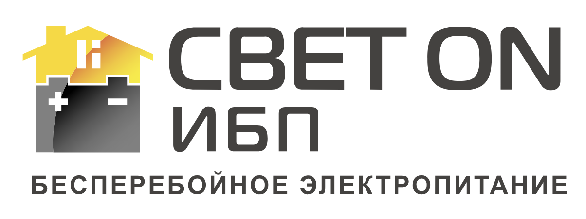

# Партнерское предложение Светон

Партнерская программа по привлечению и сопровождению клиентов

Коммерческие условия согласовываются индивидуально после заполнения анкеты партнера.

## Модель работы Светон

Светон создает инженерную услугу для клиентов, которым важно сохранить работу дома или бизнеса при отключениях, авариях и нестабильной сети.

|  |  |
|---|---|
| Для кого | Для владельцев домов, коммерческих объектов и небольших предприятий, где электропитание связано с комфортом, безопасностью или непрерывностью работы. |
| Какая проблема решается | Дом или бизнес клиента не должен останавливаться из-за отключений, аварий и нестабильной сети. |
| Что предлагаем | Готовые решения резервного электропитания под конкретный объект: от подбора оборудования до запуска системы в работу. |
| Как работаем | Сначала разбираем задачу и объект, затем подбираем решение, поставляем оборудование, организуем монтаж и ввод в эксплуатацию. |
| В чем уникальность Светон | 17 лет на рынке, инженерная экспертиза, практический опыт объектов, OEM-сборка оборудования в Китае под собственным брендом , собственный сервисный центр, гарантия 2 года на электронику и 3 года на аккумуляторы, а также ответственность перед клиентом за работающий результат. |
| С кем сотрудничаем | С электриками, монтажными бригадами, инженерами, строителями, проектировщиками, прорабами и профильными компаниями, которые работают с объектами клиентов. |

## Роли партнера в сделке

В одной сделке участник может привлечь клиента, привлечь клиента и провести технический осмотр, либо отдельно выполнить монтажные работы. Конкретная роль фиксируется по каждой сделке отдельно.

| Роль | Что делает партнер | Кто оплачивает |
|---|---|---|
| Привлечение клиента | Передает клиента, у которого есть потребность в резервном или автономном электропитании, и помогает Светон установить первый контакт. | Светон выплачивает вознаграждение за привлечение клиента. |
| Технический осмотр и сбор исходных данных | Проводит технический осмотр объекта, проверяет условия подключения, щиты, ввод, место установки, нагрузки и ограничения, делает фото/видео и фиксирует результаты осмотра. | Светон выплачивает вознаграждение за технический осмотр объекта и отчет по результатам осмотра. |
| Монтажные и иные работы | Выполняет подготовительные работы, монтаж, подключение оборудования, участвует в запуске системы. | Клиент оплачивает работы напрямую партнеру. |

## Форматы партнерства по договору

Между Светон и партнером заключается договор о привлечении и сопровождении клиентов. По этому договору используются два формата участия: Тип A - привлечение клиента, Тип Б - привлечение клиента с техническим осмотром.

Отдельный технический осмотр без привлечения клиента не относится к этому договору. В таком случае работа оформляется отдельно по договору оказания услуг между монтажником и Светон.

| Формат | Что входит | Кто платит |
|---|---|---|
| Тип A | Партнер привлекает клиента и передает его контакты. | Светон выплачивает вознаграждение за привлечение клиента. |
| Тип Б | Партнер привлекает клиента, самостоятельно проводит технический осмотр и передает исходные данные для расчета и подбора решения. | Светон выплачивает вознаграждение за привлечение клиента и согласованный технический осмотр. |

По одному клиенту Светон выплачивает вознаграждение только одному партнеру. Одновременное применение форматов Тип А и Тип Б к одному клиенту не допускается.

Если по объекту возникает необходимость монтажа, подготовительных или иных работ, такие работы согласуются между клиентом и партнером отдельно и оплачиваются клиентом напрямую партнеру.

## Как фиксируется участие партнера

Участие партнера фиксируется по конкретной сделке. Мы не считаем партнера закрепленным за клиентом вообще и не начисляем вознаграждение за клиентов, которые уже были в базе Светон или находились в работе до участия партнера.

Формат участия, клиент и сделка фиксируются в CRM и/или в реестре сделок. Это нужно, чтобы стороны одинаково понимали, за какую сделку и за какой формат участия возникает вознаграждение.

## На каких условиях мы работаем

Вознаграждение за привлечение клиента и согласованный технический осмотр выплачивает Светон после того, как система доведена до результата и введена в эксплуатацию.

Размер вознаграждения рассчитывается по номинальной мощности инвертора. Мощность аккумуляторных батарей в расчет не включается. Если мощность инвертора дробная, расчет выполняется пропорционально фактической номинальной мощности.

Выплаты производятся только безналично по реквизитам партнера. Конкретные ставки, порядок расчета и юридические условия согласовываются после заполнения анкеты партнера и указываются в договоре при подписании.

## Чего партнер не делает

Партнер не является представителем Светон, не подписывает документы от имени Светон, не принимает обязательства перед клиентом за Светон и не согласует коммерческие условия от нашего имени.

Светон самостоятельно ведет переговоры с клиентом, готовит коммерческое предложение, заключает договор, принимает оплату, поставляет оборудование и отвечает за согласованную с клиентом часть результата.

## Как начать сотрудничество

Для начала работы нужно:

1. Изучить сайт южного филиала Светон с предложением для клиентов: [domibp.ru](https://domibp.ru/).
2. Ознакомиться с данным партнерским предложением: [Коммерческое предложение партнерам Светон](https://nc.domibp.ru/index.php/s/meGsDM3wYbnbrxT).
3. Заполнить анкету партнера через раздел на сайте: [ссылка на раздел сайта будет добавлена позже] или по прямой ссылке на онлайн-форму: [анкета партнера](https://nc.domibp.ru/index.php/apps/forms/s/kmQCnLajfFTQ4a7n4E5Pooqq).
4. Передать реквизиты для договора и выплат в анкете либо отдельным сообщением через клиентский бот Светон в Telegram: [@sveton_client_bot](https://t.me/sveton_client_bot) или MAX: [@id504203415594_bot](https://max.ru/id504203415594_bot).
5. Согласовать формат участия и коммерческие условия.
6. Подписать договор о привлечении и сопровождении клиентов.
7. Передавать клиентов или участвовать в сделках после подписания договора.
