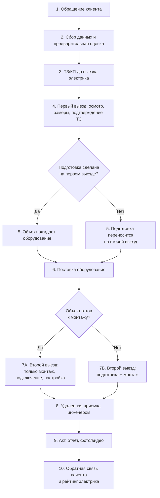
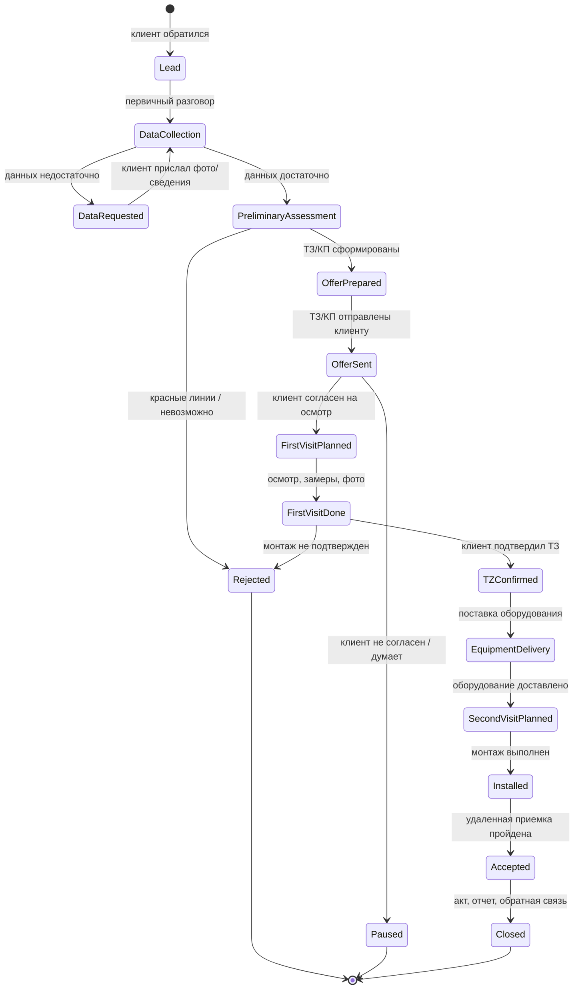
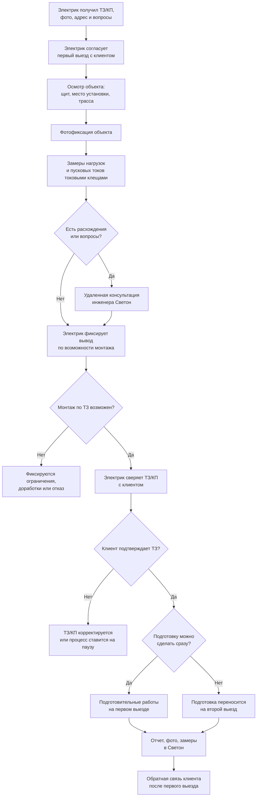
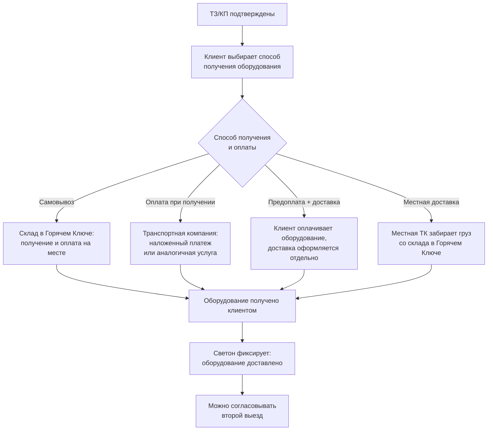
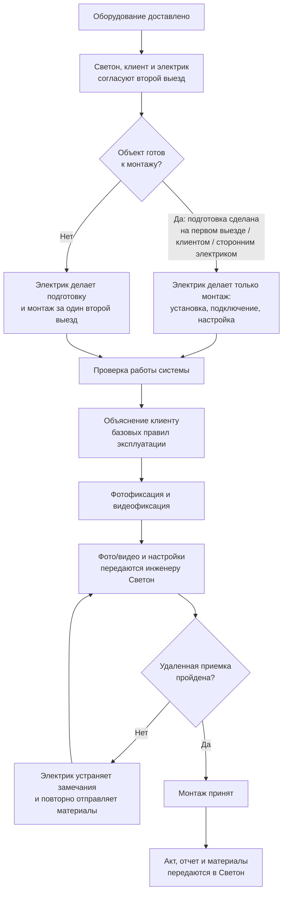
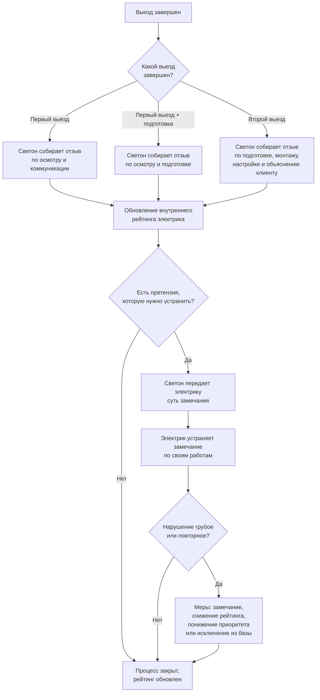

# Бизнес-процесс продажи, подготовки и монтажа ИБП на Юге

Статус: рабочее описание процесса.

Назначение: зафиксировать сквозной процесс от обращения клиента до закрытия монтажа, обратной связи и рейтинга электрика-партнера.

## Контекст южной модели

Южная модель отличается от московской: электрики не являются штатными сотрудниками Светон, работают как самостоятельные партнеры, используют свой автомобиль и инструмент, самостоятельно договариваются с клиентом по подготовительным работам и несут ответственность перед клиентом за качество своих работ.

Светон отвечает за первичный расчет, техническое задание, коммерческое предложение, поставку оборудования, доступ к базе знаний, удаленную инженерную консультацию, удаленную приемку, хранение документов и внутренний рейтинг электриков.

## Обзорная схема процесса

Файл: `00_overview_process.mmd`

## Этап 1. Первичное обращение и сбор данных

### Шаг 1. Клиент обращается в Светон

Клиент видит объявление о резервном питании или ИБП и связывается со Светон.

### Шаг 2. Мы выясняем потребность

Уточняем, что клиент хочет резервировать:

- котел;
- насосы;
- холодильник;
- интернет;
- ворота;
- охрану;
- освещение;
- другие важные нагрузки.

### Шаг 3. Собираем исходные данные

Запрашиваем:

- фото щита;
- фото места установки;
- фото возможной трассы;
- количество фаз;
- имеющееся оборудование;
- помещения под ИБП и АКБ;
- названия или характеристики оборудования, которое клиент хочет резервировать.

### Шаг 4. Делаем предварительную техническую оценку

Оцениваем:

- ориентировочную мощность;
- возможные пусковые токи;
- ограничения объекта;
- возможную схему;
- необходимость подготовительных работ;
- применимое оборудование.

Если уже на этом этапе видно, что монтаж невозможен или опасен без подготовки, это фиксируется сразу.

## Этап 2. Техническое задание и коммерческое предложение

### Шаг 5. Формируем ТЗ/КП

До выезда электрика формируем техническое задание и коммерческое предложение.

В ТЗ/КП фиксируется:

- что именно резервируется;
- какие параметры оборудования требуются;
- какое оборудование предлагается;
- стоимость оборудования;
- место установки;
- предполагаемая трасса;
- предполагаемый объем подготовительных работ;
- условие, что окончательная возможность монтажа подтверждается после осмотра объекта.

### Шаг 6. Отправляем ТЗ/КП клиенту

Клиент получает ТЗ/КП до приезда электрика и понимает, что именно предлагается.

### Шаг 7. Передаем объект электрику-партнеру

Электрик получает:

- ТЗ/КП;
- фото и материалы клиента;
- контакты клиента;
- адрес объекта;
- предварительное описание задачи;
- список вопросов, которые нужно проверить на месте.

### Диаграмма: Состояния заявки

Файл: `01_order_state.mmd`

## Этап 3. Первый выезд: осмотр и подтверждение ТЗ

### Шаг 8. Электрик согласует первый выезд

Электрик напрямую договаривается с клиентом о дате и времени первого выезда.

### Шаг 9. Электрик осматривает объект

На объекте электрик:

- сверяет объект с ТЗ/КП;
- проверяет щит;
- проверяет место установки;
- проверяет предполагаемую трассу;
- делает фотофиксацию;
- фиксирует расхождения, если объект отличается от исходных данных.

### Шаг 10. Электрик делает замеры

Электрик замеряет фактические нагрузки и, где возможно, пусковые токи токовыми клещами.

### Шаг 11. Электрик подтверждает ТЗ с клиентом

Электрик сверяет с клиентом:

- список резервируемых нагрузок;
- место установки оборудования;
- предполагаемую трассу;
- объем работ;
- ограничения решения.

### Шаг 12. Клиент подтверждает согласие с ТЗ/КП

Клиент подтверждает согласие с ТЗ/КП в согласованной форме: подписью, сообщением, электронным подтверждением или другим рабочим способом.

Без подтверждения ТЗ электрик не должен начинать подготовительные работы.

### Шаг 13. Электрик решает вопрос подготовительных работ

После осмотра есть два варианта:

- если подготовка небольшая, понятная и клиент согласен, электрик может выполнить ее сразу на первом выезде;
- если подготовка требует больше времени, материалов или удобнее выполнить ее вместе с монтажом, она переносится на второй выезд после доставки оборудования.

Стоимость подготовительных работ клиент и электрик согласуют напрямую между собой.

### Шаг 14. Светон собирает обратную связь после первого выезда

Если был только осмотр, клиент оценивает:

- пунктуальность электрика;
- вежливость;
- понятность объяснений;
- аккуратность осмотра;
- доверие к специалисту;
- были ли навязаны лишние работы;
- совпало ли понимание с ТЗ.

Если на первом выезде были подготовительные работы, дополнительно оценивается:

- качество подготовительных работ;
- аккуратность;
- порядок после работ;
- соблюдение договоренности по цене;
- наличие замечаний или претензий.

Обратная связь сохраняется во внутреннем рейтинге электрика.

### Диаграмма: Первый выезд

Файл: `02_first_visit.mmd`

## Этап 4. Поставка оборудования

### Шаг 15. Клиент выбирает способ получения оборудования

Возможные варианты:

- самовывоз со склада в Горячем Ключе с оплатой на месте;
- доставка с оплатой при получении через наложенный платеж или аналогичную услугу;
- предоплата оборудования и отдельная доставка;
- доставка местной транспортной компанией со склада в Горячем Ключе.

### Шаг 16. Светон организует отгрузку

Оборудование отгружается выбранным способом:

- из Москвы транспортной компанией;
- со склада в Горячем Ключе;
- с регионального склада, если он есть;
- местной транспортной компанией.

### Шаг 17. Клиент получает и оплачивает оборудование

Оплата происходит по выбранной схеме:

- на складе при самовывозе;
- при получении;
- наложенным платежом;
- по счету;
- через механизм, который поддерживает транспортная компания.

### Диаграмма: Поставка оборудования

Файл: `03_equipment_delivery.mmd`

## Этап 5. Второй выезд: подготовка и монтаж

### Шаг 18. Согласуется второй выезд

Второй выезд назначается после доставки оборудования.

Клиент и электрик могут договориться напрямую, но Светон должен понимать статус:

- оборудование доставлено;
- ТЗ подтверждено;
- объект подготовлен или подготовка будет выполняться во второй выезд;
- электрик готов выполнить монтаж;
- клиент понимает, что будет происходить на объекте.

### Шаг 19. Проверяется готовность объекта

Объект считается готовым, если подготовительные работы:

- выполнены электриком на первом выезде;
- выполнены клиентом самостоятельно;
- выполнены сторонним электриком клиента по нашему ТЗ.

### Шаг 20А. Если объект готов, электрик делает только монтаж

Электрик выполняет:

- установку оборудования;
- подключение;
- настройку;
- проверку работы;
- демонстрацию работы клиенту;
- объяснение базовых правил эксплуатации;
- фотофиксацию;
- видеофиксацию;
- отчет и акт.

### Шаг 20Б. Если объект не готов, электрик делает подготовку и монтаж

В один второй выезд электрик выполняет:

- подготовительные работы;
- установку оборудования;
- подключение;
- настройку;
- проверку работы;
- демонстрацию работы клиенту;
- объяснение базовых правил эксплуатации;
- фотофиксацию;
- видеофиксацию;
- отчет и акт.

Нормальная схема предусматривает максимум два выезда:

- первый выезд - осмотр и, если возможно, подготовка;
- второй выезд - после доставки оборудования: либо только монтаж, либо подготовка плюс монтаж.

## Этап 6. Удаленная инженерная поддержка и приемка

### Шаг 21. Инженер консультирует электрика при необходимости

Удаленная консультация инженера доступна:

- на первом выезде;
- при подготовительных работах;
- при монтаже;
- при подключении;
- при настройке оборудования;
- при нестандартных ситуациях.

Инженер может помочь:

- сверить объект с ТЗ;
- проверить спорные места в щите;
- уточнить трассу и место установки;
- подтвердить правильность подготовительных работ;
- проконсультировать по подключению;
- помочь с настройкой ИБП или инвертора;
- проверить фото и видео перед включением;
- подтвердить готовность к запуску.

### Шаг 22. Инженер участвует в приемке

Инженер проверяет фото, видео, настройки, спорные моменты и готовность системы к запуску.

### Шаг 23. Монтаж считается принятым после контроля

Монтаж считается принятым после выполнения условий удаленной приемки:

- фотофиксация;
- видео проверки работы системы;
- дистанционная проверка настроек.

## Этап 7. Закрытие работ и документы

### Шаг 24. Электрик подписывает акт с клиентом

Электрик фиксирует завершение работ актом или другим согласованным закрывающим документом.

### Шаг 25. Электрик передает отчет в Светон

Электрик передает:

- фото;
- видео;
- акт;
- настройки;
- описание выполненных работ;
- замечания и особенности, если они были.

### Шаг 26. Светон сохраняет материалы

Светон сохраняет все документы в карточке клиента или объекта.

### Диаграмма: Второй выезд и приемка

Файл: `04_second_visit_acceptance.mmd`

## Этап 8. Обратная связь и рейтинг электрика

### Шаг 27. Светон собирает обратную связь после второго выезда

Клиент оценивает:

- подготовительные работы, если они были во второй выезд;
- монтаж;
- подключение;
- настройку;
- объяснение клиенту;
- аккуратность;
- вежливость;
- соблюдение договоренностей;
- порядок после работ;
- наличие замечаний;
- готовность рекомендовать такого электрика.

### Шаг 28. Светон обновляет рейтинг электрика

В рейтинг входят:

- оценки клиентов после выездов;
- качество фото и видео отчетов;
- соблюдение ТЗ;
- количество замечаний инженера;
- количество переделок;
- пунктуальность;
- аккуратность;
- корректность общения;
- готовность устранять замечания;
- повторные жалобы или их отсутствие.

### Шаг 29. Светон передает электрику претензии, если они есть

Отзывы клиента используются внутри Светон. Если отзыв содержит претензию, которую нужно устранить, электрику передается суть проблемы без лишнего раскрытия клиентской обратной связи.

### Шаг 30. При нарушениях применяются меры

Возможные меры:

- замечание;
- обязательное устранение недостатков;
- временное снижение рейтинга;
- понижение приоритета при распределении следующих объектов;
- исключение из партнерской базы;
- иные меры, если они предусмотрены партнерским соглашением.

Основания:

- жалобы клиентов;
- отказ делать фото или видео отчет;
- несоблюдение ТЗ;
- самовольное изменение схемы;
- грубое общение;
- нарушение сроков;
- повторные переделки;
- отказ устранять замечания.

### Диаграмма: Обратная связь и рейтинг

Файл: `05_feedback_rating.mmd`

## Этап 9. Граница ответственности южной модели

### Шаг 31. Светон отвечает за свою часть

Светон отвечает за:

- первичный расчет;
- ТЗ/КП;
- подбор и поставку оборудования;
- доступ к базе знаний;
- удаленную консультацию инженера;
- удаленную приемку;
- хранение фото, видео, актов и отчетов;
- внутренний рейтинг электриков.

### Шаг 32. Электрик отвечает за свою часть

Электрик-партнер отвечает перед клиентом за:

- качество подготовительных работ, которые клиент согласовал и оплачивает ему напрямую;
- качество своих электромонтажных работ;
- аккуратность;
- соблюдение договоренностей с клиентом;
- корректное поведение на объекте;
- устранение замечаний по своим работам.

### Шаг 33. Модель фиксируется как партнерская

Электрик не является штатным сотрудником Светон. Он самостоятельный партнер, но получает доступ к объектам Светон только при соблюдении стандартов качества, отчетности и поведения.

## Короткая схема процесса

1. Клиент обращается.
2. Светон выясняет потребность.
3. Светон собирает фото и исходные данные.
4. Светон формирует ТЗ/КП.
5. Клиент получает ТЗ/КП.
6. Светон передает объект электрику.
7. Электрик согласует первый выезд.
8. Электрик осматривает объект, делает замеры и сверяет ТЗ.
9. Клиент подтверждает ТЗ.
10. Подготовка делается на первом выезде или переносится на второй.
11. Светон собирает обратную связь после первого выезда.
12. Клиент выбирает способ получения оборудования.
13. Оборудование доставляется.
14. Согласуется второй выезд.
15. Если объект готов, электрик делает монтаж.
16. Если объект не готов, электрик делает подготовку и монтаж.
17. Инженер Светон консультирует и принимает удаленно.
18. Электрик передает фото, видео, акт и отчет.
19. Светон собирает обратную связь после второго выезда.
20. Рейтинг электрика обновляется.
