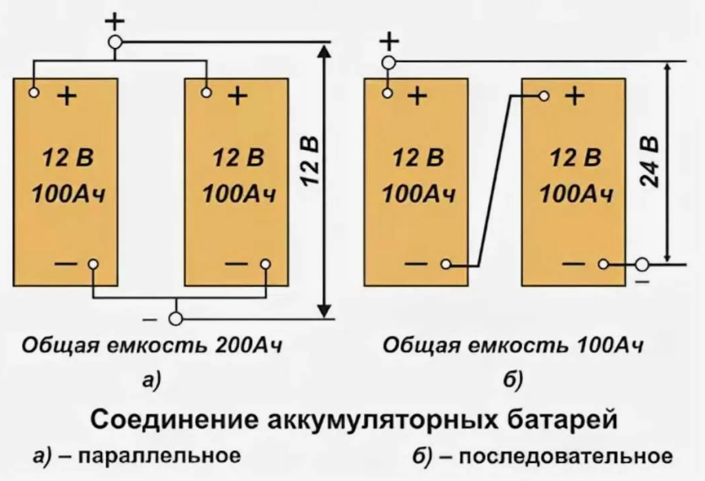

# Базовые знания: ИБП, AC/DC и подключение АКБ

Статус: черновик редакционного раздела на базе canonical-утверждений и визуального примера из исходного DOCX.

Источник слоя знаний:

```text
00_input/documents/electricians_knowledge_base/statements/atomic_statements.jsonl
00_input/documents/electricians_knowledge_base/statements/statement_images.jsonl
```

Кластер: `C006` / `basic_knowledge`

Основной исходный документ: `ЭЛК_1_Базовые_знания_Основные_понятия_ред1_1.docx`

## Правило использования

Этот раздел можно использовать как вводный учебный материал по ИБП, AC/DC и базовым принципам соединения АКБ.

Каждый пункт связан с canonical `statement_id`, чтобы можно было вернуться к исходному утверждению и цитате.

Пункты с пометкой `safety-review` требуют экспертной проверки перед тем, как включать их в финальную инструкцию для монтажников.

Если пункт связан с изображением, рядом указан `image_id`. Изображение не создает новое правило само по себе, а иллюстрирует текстовые утверждения из источника.

## ИБП

ИБП предназначен для обеспечения бесперебойного электропитания при отключении электроэнергии от внешней сети.  
Источник: `doc_011_chunk_0003_stmt_001`

## AC/DC

В исходном документе `AC` определяется как переменный ток.  
Источник: `doc_011_chunk_0004_stmt_001`

В исходном документе `DC` определяется как постоянный ток.  
Источник: `doc_011_chunk_0004_stmt_002`

В исходном документе `AC` также используется как обозначение переменного напряжения. `review-required`  
Источник: `doc_011_chunk_0004_stmt_003`

Формулировка `DC - переменное напряжение` не включена в canonical как валидное знание, потому что противоречит строке `DC - это постоянный ток`.

Связанная проблема источника: `SQI001` в `source_quality_issues.md`.

## Принцип работы ИБП

ИБП преобразует переменный ток из сети в постоянный ток для зарядки аккумуляторов.  
Источник: `doc_011_chunk_0005_stmt_001`

При наличии внешней сети ИБП подключается к сети переменного тока, которая заряжает аккумуляторы.  
Источник: `doc_011_chunk_0005_stmt_003`

При отключении электроснабжения ИБП преобразует постоянный ток аккумуляторов обратно в переменный ток.  
Источник: `doc_011_chunk_0005_stmt_002`

Когда внешняя сеть отключается, энергия аккумуляторов используется для обеспечения непрерывного питания подключенных устройств.  
Источник: `doc_011_chunk_0005_stmt_004`

При восстановлении питания из сети ИБП снова заряжает аккумуляторы для подготовки к возможному новому отключению электропитания.  
Источник: `doc_011_chunk_0005_stmt_005`

## Подключение аккумуляторов

Последовательное подключение АКБ выполняется соединением нескольких аккумуляторов клеммами `минус - плюс`. `safety-review`  
Источник: `doc_011_chunk_0006_stmt_001`

При последовательном соединении АКБ напряжение соединяемых аккумуляторов суммируется, а емкость группы соответствует номинальной емкости используемых АКБ. `safety-review`  
Источник: `doc_011_chunk_0006_stmt_003`

Параллельное подключение АКБ выполняется соединением нескольких аккумуляторов клеммами `минус - минус` и `плюс - плюс`. `safety-review`  
Источник: `doc_011_chunk_0006_stmt_002`

При параллельном соединении АКБ напряжение не меняется, а емкости суммируются. `safety-review`  
Источник: `doc_011_chunk_0006_stmt_004`

Визуальный пример из исходного документа:



`image_id`: `img_0003`  
Связи:

- `doc_011_chunk_0006_stmt_001 -> img_0003`
- `doc_011_chunk_0006_stmt_002 -> img_0003`
- `doc_011_chunk_0006_stmt_003 -> img_0003`
- `doc_011_chunk_0006_stmt_004 -> img_0003`

## Используемые АКБ

В работе используются АКБ с номинальным напряжением 12 В и емкостью 65 Ач, 100 Ач, 150 Ач или 200 Ач.  
Источник: `doc_011_chunk_0006_stmt_005`

## Очередь safety-review по разделу

Перед финальным утверждением раздела нужно проверить:

- определение `AC` как переменного напряжения в контексте раздела AC/DC;
- формулировки по последовательному подключению АКБ;
- формулировки по параллельному подключению АКБ;
- формулировки по суммированию напряжения и емкости;
- возможность использовать схему `img_0003` как учебный материал.

Связанный файл очереди:

```text
00_input/documents/electricians_knowledge_base/statements/safety_review_queue.md
```

## Открытые вопросы

- Нужно исправить или подтвердить исходную строку `DC - переменное напряжение`.
- Нужно решить, какие предупреждения по безопасности должны стоять перед схемой подключения АКБ.
