# Состав ИБП и компоненты системы

Статус: черновик редакционного раздела на базе canonical-утверждений и визуальных примеров из исходного DOCX.

Источник слоя знаний:

```text
00_input/documents/electricians_knowledge_base/statements/atomic_statements.jsonl
00_input/documents/electricians_knowledge_base/statements/statement_images.jsonl
```

Кластер: `C007` / `ups_components`

Основной исходный документ: `ЭЛК_2_Базовые_знания_Состав_ИБП_ред1_5.docx`

## Правило использования

Этот раздел можно использовать как учебный материал по составу ИБП и назначению компонентов системы.

Каждый пункт связан с canonical `statement_id`, чтобы можно было вернуться к исходному утверждению и цитате.

Пункты с пометкой `safety-review` требуют экспертной проверки перед тем, как включать их в финальную инструкцию для монтажников.

Если пункт связан с изображением, рядом указан `image_id`. Изображения не создают новые правила сами по себе, а иллюстрируют текстовые утверждения из источника.

## Краткий состав системы

В составе ИБП отдельно описаны инвертор, аккумуляторы, байпасный щит, балансир, защита по постоянному току, стеллаж, защитные панели и GSM-розетка.

- Инвертор является преобразователем.  
  Источник: `doc_013_chunk_0004_stmt_001`
- Аккумуляторы обеспечивают запас энергии.  
  Источник: `doc_013_chunk_0005_stmt_001`
- Байпасный щит позволяет вручную переключать питание `От сети напрямую` или `Через ИБП`. `safety-review`  
  Источник: `doc_013_chunk_0006_stmt_001`
- Балансир осуществляет балансировку аккумуляторов.  
  Источник: `doc_013_chunk_0007_stmt_001`
- DC-защита представляет собой предохранитель большого номинального тока. `safety-review`  
  Источник: `doc_013_chunk_0008_stmt_001`
- Стеллаж предназначен для аккумуляторов.  
  Источник: `doc_013_chunk_0009_stmt_001`
- Защитные панели крепятся на стеллаж саморезами.  
  Источник: `doc_013_chunk_0010_stmt_001`
- Для работы GSM-розетки требуется СИМ-карта.  
  Источник: `doc_013_chunk_0011_stmt_001`

## Инвертор

Инвертор преобразует постоянный ток аккумуляторов в переменный ток для питания стандартных электропотребителей.  
Источник: `doc_013_chunk_0004_stmt_002`

Все инверторы, используемые в системах компании, имеют зарядные устройства и при необходимости подзаряжают аккумуляторы.  
Источник: `doc_013_chunk_0004_stmt_003`

Инвертор может использоваться как источник питания для бытовой и офисной техники.  
Источник: `doc_013_chunk_0013_stmt_001`

Инвертор может питать приборы с электрическим двигателем, включая вентиляторы, холодильники и кондиционеры.  
Источник: `doc_013_chunk_0013_stmt_002`

Инвертор может питать осветительные приборы.  
Источник: `doc_013_chunk_0013_stmt_003`

Визуальные примеры из исходного документа:

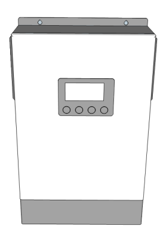

`image_id`: `img_0031`  
Связи:

- `doc_013_chunk_0013_stmt_001 -> img_0031`
- `doc_013_chunk_0013_stmt_002 -> img_0031`
- `doc_013_chunk_0013_stmt_003 -> img_0031`

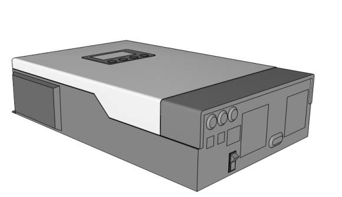

`image_id`: `img_0032`  
Связи:

- `doc_013_chunk_0013_stmt_001 -> img_0032`
- `doc_013_chunk_0013_stmt_002 -> img_0032`
- `doc_013_chunk_0013_stmt_003 -> img_0032`

## Аккумуляторная батарея

АКБ является устройством, способным хранить электрическую энергию и отдавать ее.  
Источник: `doc_013_chunk_0014_stmt_001`

Важные характеристики АКБ:

- емкость, то есть количество энергии, которое аккумуляторы могут хранить;  
  Источник: `doc_013_chunk_0014_stmt_002`
- напряжение;  
  Источник: `doc_013_chunk_0014_stmt_003`
- тип химических элементов и технология изготовления;  
  Источник: `doc_013_chunk_0014_stmt_004`
- цикличность, то есть количество циклов зарядки-разрядки;  
  Источник: `doc_013_chunk_0014_stmt_007`
- ток зарядки, который зависит от типа АКБ и ее емкости;  
  Источник: `doc_013_chunk_0014_stmt_008`
- оптимальная температура работы, которая зависит от типа АКБ.  
  Источник: `doc_013_chunk_0014_stmt_009`

Свинцово-кислотные АКБ разделяются на AGM, гелевые и наливные.  
Источник: `doc_013_chunk_0014_stmt_005`

Существуют литиевые аккумуляторы с различным химическим составом.  
Источник: `doc_013_chunk_0014_stmt_006`

## Группа АКБ

Группа АКБ состоит из нескольких АКБ одного типа, емкости, напряжения и партии, соединенных последовательно. `safety-review`  
Источник: `doc_013_chunk_0015_stmt_001`

Группа АКБ собирается для достижения определенного уровня емкости и напряжения, на котором работает инвертор. `safety-review`  
Источник: `doc_013_chunk_0015_stmt_002`

Несколько групп последовательно подключенных АКБ можно подключить параллельно. `safety-review`  
Источник: `doc_013_chunk_0015_stmt_003`

Визуальный пример из исходного документа:

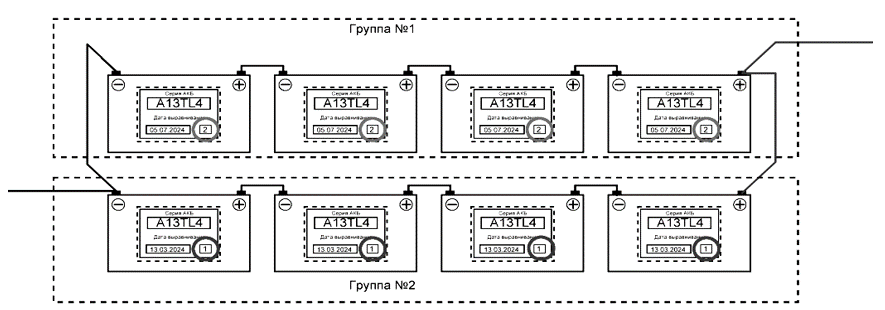

`image_id`: `img_0033`  
Связи:

- `doc_013_chunk_0015_stmt_001 -> img_0033`
- `doc_013_chunk_0015_stmt_002 -> img_0033`
- `doc_013_chunk_0015_stmt_003 -> img_0033`

## Байпасный щит

Байпас в документе определяется как обход.  
Источник: `doc_013_chunk_0016_stmt_001`

Ручной байпас применяется для обхода инвертора. `safety-review`  
Источник: `doc_013_chunk_0016_stmt_002`

Байпасный щит помогает поддерживать непрерывность работы электропотребителей при проблемах с ИБП.  
Источник: `doc_013_chunk_0016_stmt_003`

Байпасный щит используется только в особых случаях, например для обслуживания ИБП или в форс-мажорных ситуациях. `safety-review`  
Источник: `doc_013_chunk_0016_stmt_006`

Клиент может переключиться на внешнюю сеть минуя ИБП, если есть подозрения на некорректную работу ИБП. `safety-review`  
Источник: `doc_013_chunk_0016_stmt_007`

Визуальный пример из исходного документа:

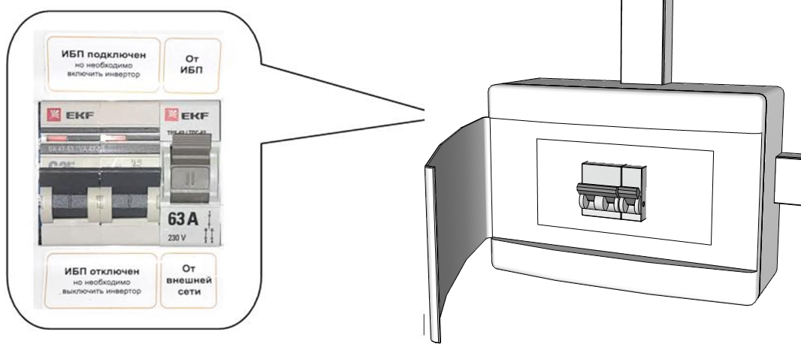

`image_id`: `img_0034`  
Связи:

- `doc_013_chunk_0016_stmt_001 -> img_0034`
- `doc_013_chunk_0016_stmt_002 -> img_0034`
- `doc_013_chunk_0016_stmt_003 -> img_0034`
- `doc_013_chunk_0016_stmt_006 -> img_0034`
- `doc_013_chunk_0016_stmt_007 -> img_0034`

Когда оборудование введено в работу, энергия передается в дом через ИБП. `safety-review`  
Источник: `doc_013_chunk_0016_stmt_004`

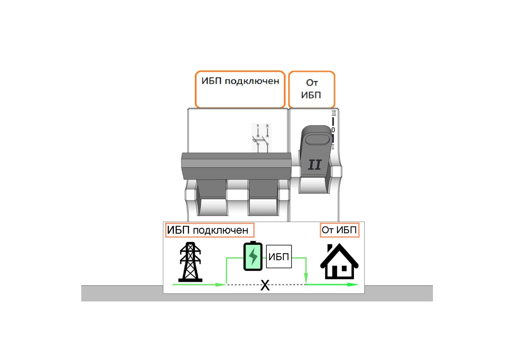

`image_id`: `img_0035`  
Связь: `doc_013_chunk_0016_stmt_004 -> img_0035`

Когда оборудование выведено из работы, энергия напрямую передается в дом минуя ИБП. `safety-review`  
Источник: `doc_013_chunk_0016_stmt_005`

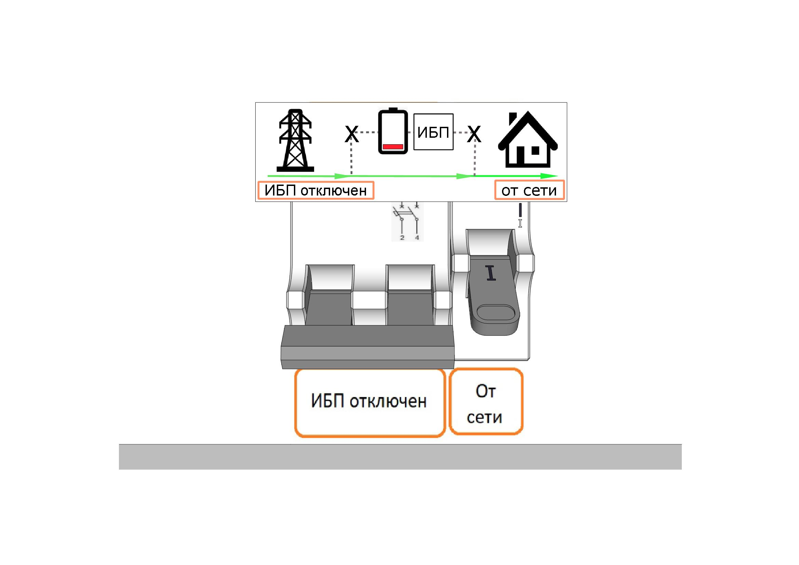

`image_id`: `img_0036`  
Связь: `doc_013_chunk_0016_stmt_005 -> img_0036`

Для штатной работы ИБП в инверторе присутствует переходное реле.  
Источник: `doc_013_chunk_0016_stmt_008`

Переходное реле отвечает за переключение ИБП на работу от АКБ при пропадании внешней сети и обратно. `safety-review`  
Источник: `doc_013_chunk_0016_stmt_009`

## Балансир

Балансир продлевает срок службы аккумуляторов.  
Источник: `doc_013_chunk_0007_stmt_002`

Балансир предназначен для выравнивания напряжения между АКБ в одной или нескольких группах. `safety-review`  
Источник: `doc_013_chunk_0017_stmt_001`

Балансир имеет строго определенную схему подключения. `safety-review`  
Источник: `doc_013_chunk_0017_stmt_002`

Балансиры делятся на два типа в зависимости от группы: на 24 В и на 48 В. `safety-review`  
Источник: `doc_013_chunk_0017_stmt_003`

Визуальные примеры из исходного документа:

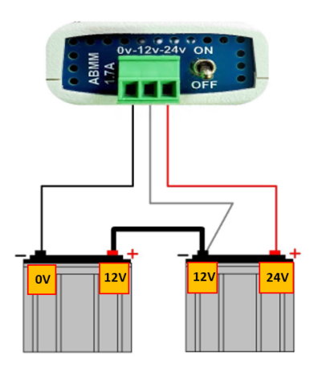

`image_id`: `img_0037`  
Связи:

- `doc_013_chunk_0017_stmt_001 -> img_0037`
- `doc_013_chunk_0017_stmt_002 -> img_0037`
- `doc_013_chunk_0017_stmt_003 -> img_0037`

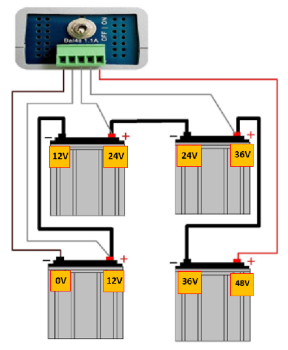

`image_id`: `img_0038`  
Связи:

- `doc_013_chunk_0017_stmt_001 -> img_0038`
- `doc_013_chunk_0017_stmt_002 -> img_0038`
- `doc_013_chunk_0017_stmt_003 -> img_0038`

## Выравнивающая перемычка

Выравнивающая перемычка предназначена для объединения нескольких групп АКБ в двух и более последовательных цепочках АКБ. `safety-review`  
Источник: `doc_013_chunk_0018_stmt_001`

Выравнивающая перемычка служит для выравнивания напряжения на всех группах АКБ. `safety-review`  
Источник: `doc_013_chunk_0018_stmt_002`

Выравнивающая перемычка используется с балансиром. `safety-review`  
Источник: `doc_013_chunk_0018_stmt_003`

В документе приведен пример выравнивающей перемычки между двумя группами АКБ в системе на 24 В. `safety-review`  
Источник: `doc_013_chunk_0019_stmt_001`

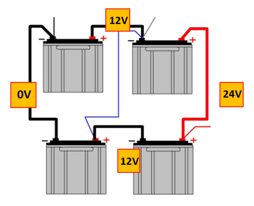

`image_id`: `img_0039`  
Связь: `doc_013_chunk_0019_stmt_001 -> img_0039`

В документе приведен пример выравнивающих перемычек между группами АКБ на 48 В. `safety-review`  
Источник: `doc_013_chunk_0020_stmt_001`

При установке выравнивающих перемычек нельзя ошибаться, потому что ошибка подключения может привести к возгоранию изоляции перемычки. `safety-review`  
Источник: `doc_013_chunk_0020_stmt_002`

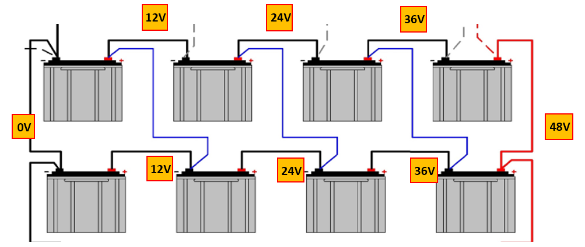

`image_id`: `img_0040`  
Связи:

- `doc_013_chunk_0020_stmt_001 -> img_0040`
- `doc_013_chunk_0020_stmt_002 -> img_0040`

## Защита по постоянному току

DC-защита устанавливается между инвертором и группой аккумуляторов. `safety-review`  
Источник: `doc_013_chunk_0008_stmt_002`

DC-защита является предохранителем от высокого тока 150 А или 200 А в защитном пластиковом корпусе. `safety-review`  
Источник: `doc_013_chunk_0021_stmt_001`

DC-защита устанавливается между инвертором и группой аккумуляторов. `safety-review`  
Источник: `doc_013_chunk_0021_stmt_002`

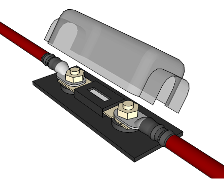

`image_id`: `img_0042`  
Связи:

- `doc_013_chunk_0021_stmt_001 -> img_0042`
- `doc_013_chunk_0021_stmt_002 -> img_0042`

## Стеллаж и защитные панели

Стеллаж является стойкой для установки АКБ.  
Источник: `doc_013_chunk_0022_stmt_001`

Стеллаж для АКБ отличается от обычных стеллажей усиленной конструкцией и выдерживает большую нагрузку.  
Источник: `doc_013_chunk_0022_stmt_002`

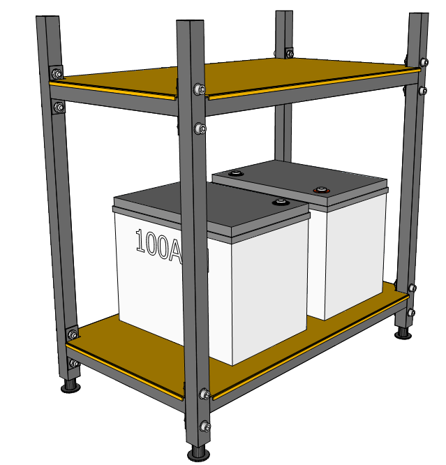

`image_id`: `img_0043`  
Связи:

- `doc_013_chunk_0022_stmt_001 -> img_0043`
- `doc_013_chunk_0022_stmt_002 -> img_0043`

Защитные панели в стандартной комплектации не поставляются и устанавливаются по желанию клиента.  
Источник: `doc_013_chunk_0010_stmt_002`

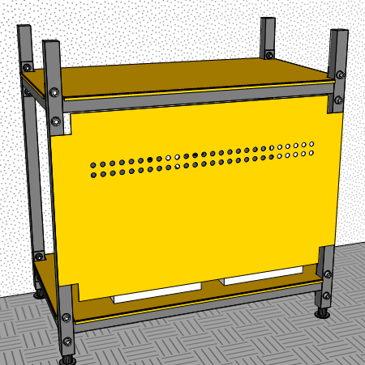

`image_id`: `img_0044`  
Связь: visual-only coverage override `doc_013_chunk_0023`

## GSM-розетка

Клиент покупает СИМ-карту для GSM-розетки самостоятельно.  
Источник: `doc_013_chunk_0011_stmt_002`

GSM-розетка информирует об отключении или включении внешней сети.  
Источник: `doc_013_chunk_0011_stmt_003`

GSM-розетка в стандартной комплектации не поставляется и устанавливается по желанию клиента.  
Источник: `doc_013_chunk_0011_stmt_004`

GSM-розетка работает при помощи SIM-карты.  
Источник: `doc_013_chunk_0024_stmt_001`

GSM-розетка получает команды по SMS и отправляет SMS о необходимых событиях.  
Источник: `doc_013_chunk_0024_stmt_002`

Клиент приобретает СИМ-карту для GSM-розетки самостоятельно.  
Источник: `doc_013_chunk_0024_stmt_003`

GSM-розетка обычно подключается в розетку, которая не относится к резервной группе и не запитана от ИБП. `safety-review`  
Источник: `doc_013_chunk_0024_stmt_004`

В системах компании GSM-розетка нужна только для отправки SMS о пропадании внешней электросети и о появлении внешней электросети.  
Источник: `doc_013_chunk_0024_stmt_005`

GSM-розетка информирует только о состоянии внешней сети, а не о работе ИБП.  
Источник: `doc_013_chunk_0024_stmt_006`

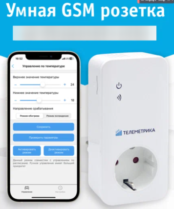

`image_id`: `img_0045`  
Связи:

- `doc_013_chunk_0024_stmt_001 -> img_0045`
- `doc_013_chunk_0024_stmt_002 -> img_0045`
- `doc_013_chunk_0024_stmt_003 -> img_0045`
- `doc_013_chunk_0024_stmt_004 -> img_0045`
- `doc_013_chunk_0024_stmt_005 -> img_0045`
- `doc_013_chunk_0024_stmt_006 -> img_0045`

Связанная проблема источника: `SQI003` в `source_quality_issues.md`.

## Очередь safety-review по разделу

Перед финальным утверждением раздела нужно проверить:

- ручной байпас и условия его использования;
- режимы `оборудование введено в работу` и `оборудование выведено из работы`;
- сценарий переключения клиента на внешнюю сеть минуя ИБП;
- переходное реле инвертора;
- схемы подключения балансиров на 24 В и 48 В;
- выравнивающие перемычки и предупреждение о возгорании изоляции;
- DC-защиту 150 А или 200 А;
- требование подключать GSM-розетку вне резервной группы.

Связанный файл очереди:

```text
00_input/documents/electricians_knowledge_base/statements/safety_review_queue.md
```

## Открытые вопросы

- Нужно исправить в исходнике опечатку `ИПБ`.
- Нужно восстановить оборванную фразу про приложение Телеметрика.
- Нужно решить, какие визуальные схемы можно использовать в обучении монтажников без дополнительных предупреждений.
