# Электрический щит клиента, УЗО, шины и мастер-выключатель

Статус: черновик редакционного раздела на базе canonical-утверждений и визуальных примеров из исходного DOCX.

Источник слоя знаний:

```text
00_input/documents/electricians_knowledge_base/statements/atomic_statements.jsonl
00_input/documents/electricians_knowledge_base/statements/statement_images.jsonl
```

Кластер: `C008` / `distribution_boards`

Основной исходный документ: `ЭЛК_4_Базовые_знания_Элементы_распред_щитов_ред1.docx`

## Правило использования

Этот раздел можно использовать как черновик учебного материала по распределительным щитам, УЗО, PE/N-шинам, контактору и мастер-выключателю.

Каждый пункт связан с canonical `statement_id`, чтобы можно было вернуться к исходному утверждению и цитате.

Пункты с пометкой `safety-review` требуют экспертной проверки перед тем, как включать их в финальную инструкцию для монтажников.

Если пункт связан с изображением, рядом указан `image_id`. Изображения не создают новые правила сами по себе, а иллюстрируют текстовые утверждения из источника.

## Разбор схемы щита

В процессе монтажа, а в некоторых случаях перед монтажом системы, нужно вскрыть крышку вводного щита клиента и разобраться в логике распределения схемы щита. `safety-review`  
Источник: `doc_016_chunk_0001_stmt_001`

Разбор схемы щита нужно начинать от источника электропитания и двигаться в сторону нагрузки. `safety-review`  
Источник: `doc_016_chunk_0001_stmt_002`

Схему щита нужно понять, чтобы корректно подключить ИБП и не совершить ошибку, которая может привести к порче оборудования. `safety-review`  
Источник: `doc_016_chunk_0001_stmt_003`

Визуальный пример из исходного документа:

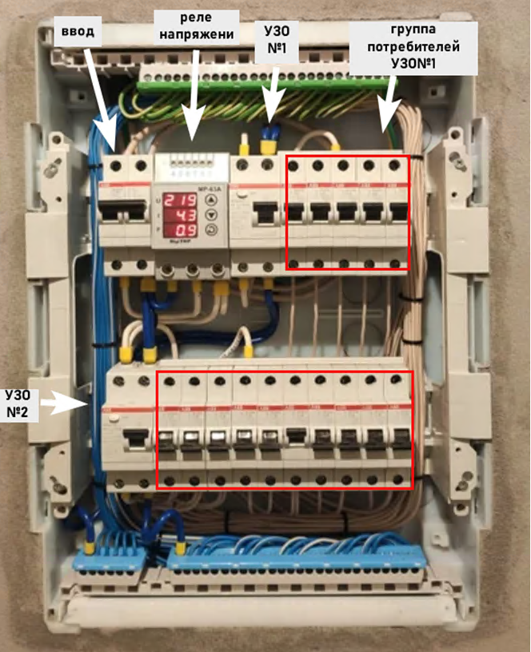

`image_id`: `img_0086`  
Связи:

- `doc_016_chunk_0001_stmt_001 -> img_0086`
- `doc_016_chunk_0001_stmt_002 -> img_0086`
- `doc_016_chunk_0001_stmt_003 -> img_0086`

## Ввод, реле напряжения и УЗО

Кабель от электрощита `на столбе` подводится к верхним клеммам главного выключателя `Ввод`. `safety-review`  
Источник: `doc_016_chunk_0002_stmt_001`

У вводного кабеля в описанном щите две рабочие жилы: фаза и ноль. `safety-review`  
Источник: `doc_016_chunk_0002_stmt_002`

Главный выключатель `Ввод` позволяет вручную отключить электропитание сразу во всем доме. `safety-review`  
Источник: `doc_016_chunk_0002_stmt_003`

С `Ввода` фаза и ноль подключаются к входу реле напряжения. `safety-review`  
Источник: `doc_016_chunk_0002_stmt_004`

Реле напряжения контролирует уровень напряжения сети в заданном диапазоне.  
Источник: `doc_016_chunk_0002_stmt_005`

Если напряжение выходит за программно заданный диапазон, реле напряжения отключает подачу напряжения и защищает потребителей от завышения или занижения напряжения в сети.  
Источник: `doc_016_chunk_0002_stmt_006`

С выхода реле напряжения фаза и ноль подаются на верхние контакты УЗО. `safety-review`  
Источник: `doc_016_chunk_0002_stmt_007`

Подключения фазы и нуля до верхних контактов УЗО считаются `до УЗО`, а фаза и ноль, выходящие снизу, считаются `после УЗО`. `safety-review`  
Источник: `doc_016_chunk_0002_stmt_008`

При использовании дифференциального автомата или УЗО отключение электропитания при неисправности происходит автоматически на защищаемой линии или на вводе, если защитное устройство установлено только там.  
Источник: `doc_016_chunk_0002_stmt_009`

Визуальный пример из исходного документа:

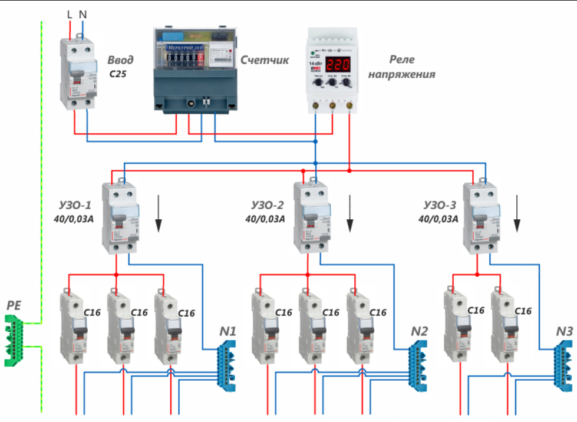

`image_id`: `img_0087`  
Связи:

- `doc_016_chunk_0002_stmt_001 -> img_0087`
- `doc_016_chunk_0002_stmt_002 -> img_0087`
- `doc_016_chunk_0002_stmt_003 -> img_0087`
- `doc_016_chunk_0002_stmt_004 -> img_0087`
- `doc_016_chunk_0002_stmt_005 -> img_0087`
- `doc_016_chunk_0002_stmt_006 -> img_0087`
- `doc_016_chunk_0002_stmt_007 -> img_0087`
- `doc_016_chunk_0002_stmt_008 -> img_0087`
- `doc_016_chunk_0002_stmt_009 -> img_0087`

## Фазы, нули и заземление в щите

Фаза после УЗО распределяется по группам выключателей с помощью гребенчатой шины. `safety-review`  
Источник: `doc_016_chunk_0002_stmt_010`

Ноль после УЗО поступает на отдельную шину, предназначенную только потребителям, чья фаза подключена после этого УЗО. `safety-review`  
Источник: `doc_016_chunk_0002_stmt_011`

Группы выключателей защищают цепи розеток, освещения, электроплит и электрокотлов от коротких замыканий.  
Источник: `doc_016_chunk_0002_stmt_012`

К автоматам подключаются фазные провода защищаемых цепей. `safety-review`  
Источник: `doc_016_chunk_0002_stmt_013`

Нулевые провода цепей потребителей подключаются к нулевым шинам того УЗО, которое защищает группу этих цепей. `safety-review`  
Источник: `doc_016_chunk_0002_stmt_014`

Заземляющие провода цепей потребителей подключаются к общей шине заземления, соединенной с контуром заземления дома. `safety-review`  
Источник: `doc_016_chunk_0002_stmt_015`

На первых самостоятельных монтажах во время обучения лучше зарисовывать схему щита на бумаге в удобном виде.  
Источник: `doc_016_chunk_0002_stmt_016`

Связь со схемой щита: `doc_016_chunk_0002_stmt_010` - `doc_016_chunk_0002_stmt_016 -> img_0087`

## PE-проводники

Заземляющий проводник PE от заземляющего контура дома идет к шине заземления в щитке. `safety-review`  
Источник: `doc_016_chunk_0003_stmt_001`

От шины заземления отходят PE-кабели к розеткам, где они подключаются к своим клеммам. `safety-review`  
Источник: `doc_016_chunk_0003_stmt_002`

Подключение PE-проводников обеспечивает возможность заземления электроприборов.  
Источник: `doc_016_chunk_0003_stmt_003`

## Нейтральные и заземляющие шины

К нейтральным N и заземляющим PE шинам в щитках подключаются сразу несколько проводников. `safety-review`  
Источник: `doc_016_chunk_0004_stmt_001`

Один провод соединяет шину с главной нейтралью или заземлением в доме, что облегчает организацию проводки в щите. `safety-review`  
Источник: `doc_016_chunk_0004_stmt_002`

Контактные части шин выполнены из меди или медного сплава, а проводники фиксируются в них винтами.  
Источник: `doc_016_chunk_0004_stmt_003`

Токопроводящие колодки шин закрепляются в держателе из изоляционного материала.  
Источник: `doc_016_chunk_0004_stmt_004`

Как правило, шины устанавливаются вверху или внизу внутреннего пространства щитка.  
Источник: `doc_016_chunk_0004_stmt_005`

Визуальный пример из исходного документа:

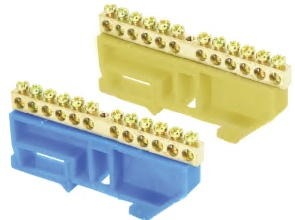

`image_id`: `img_0088`  
Связи:

- `doc_016_chunk_0004_stmt_001 -> img_0088`
- `doc_016_chunk_0004_stmt_002 -> img_0088`
- `doc_016_chunk_0004_stmt_003 -> img_0088`
- `doc_016_chunk_0004_stmt_004 -> img_0088`
- `doc_016_chunk_0004_stmt_005 -> img_0088`

## УЗО

Автоматическое отключение электроэнергии является одним из главных способов защиты человека от удара электрическим током.  
Источник: `doc_016_chunk_0005_stmt_001`

УЗО реагирует на ток утечки в электрической цепи.  
Источник: `doc_016_chunk_0005_stmt_002`

Принцип работы УЗО основан на контроле разницы между входящим и исходящим током.  
Источник: `doc_016_chunk_0005_stmt_003`

Утечка тока может возникнуть при коротком замыкании или повреждении изоляции в контролируемой цепи.  
Источник: `doc_016_chunk_0005_stmt_004`

УЗО сравнивает ток, поступающий в электрическую цепь по фазе L, с током, который возвращается по нейтрали N.  
Источник: `doc_016_chunk_0005_stmt_005`

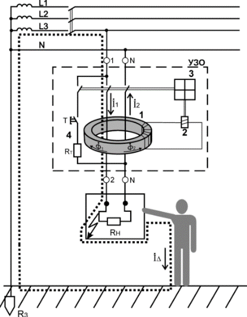

`image_id`: `img_0091`  
Связи:

- `doc_016_chunk_0005_stmt_002 -> img_0091`
- `doc_016_chunk_0005_stmt_003 -> img_0091`
- `doc_016_chunk_0005_stmt_004 -> img_0091`
- `doc_016_chunk_0005_stmt_005 -> img_0091`

Если разница между током по фазе и током по нейтрали превышает заданный предел, УЗО срабатывает и отключает электрическую цепь.  
Источник: `doc_016_chunk_0005_stmt_006`

УЗО помогает предотвратить возгорания и защищает человека от поражения электрическим током.  
Источник: `doc_016_chunk_0005_stmt_007`

Согласно схеме в документе, УЗО подключается к источнику через верхние клеммники по маркировке на клеммах. `safety-review`  
Источник: `doc_016_chunk_0005_stmt_008`

В щите может быть установлено несколько УЗО, каждое из которых контролирует только свою цепь с потребителями и имеет свою отходящую фазу и нулевую шину. `safety-review`  
Источник: `doc_016_chunk_0005_stmt_011`

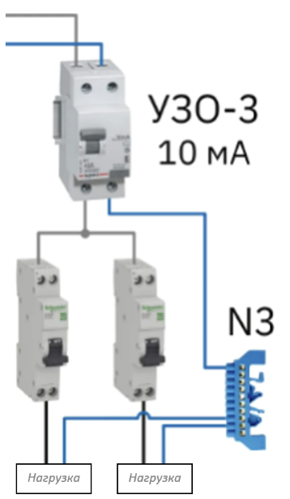

`image_id`: `img_0092`  
Связи:

- `doc_016_chunk_0005_stmt_006 -> img_0092`
- `doc_016_chunk_0005_stmt_007 -> img_0092`
- `doc_016_chunk_0005_stmt_008 -> img_0092`
- `doc_016_chunk_0005_stmt_011 -> img_0092`

При добавлении нового или дополнительного потребителя нужно учитывать точку подключения `после УЗО` либо `до УЗО` и выбирать правильную точку подключения нейтрального провода. `safety-review`  
Источник: `doc_016_chunk_0005_stmt_009`

Если питание группы потребителя нужно переключить до УЗО к L, то нулевой провод этой группы нужно переключить до УЗО к N. `safety-review`  
Источник: `doc_016_chunk_0005_stmt_010`

## Переборка щита с УЗО

При переборке щита с одним или несколькими УЗО нужно четко следить за подключением фазы и нуля потребителя. `safety-review`  
Источник: `doc_016_chunk_0006_stmt_001`

Если при переборке щита совершена ошибка в цепи УЗО, при включении питания сработает защита тех УЗО, в цепи которых совершена ошибка. `safety-review`  
Источник: `doc_016_chunk_0006_stmt_002`

При переборке щита и выделении группы резерва нужно точно определить, к каким УЗО потребители группы резерва были подключены до переборки. `safety-review`  
Источник: `doc_016_chunk_0006_stmt_003`

Во время переборки щита фазы и нули потребителей резерва нужно собирать под одним УЗО. `safety-review`  
Источник: `doc_016_chunk_0006_stmt_004`

Визуальный пример из исходного документа:

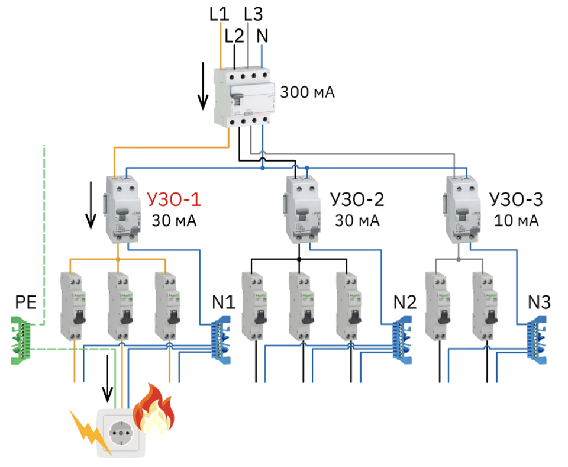

`image_id`: `img_0094`  
Связи:

- `doc_016_chunk_0006_stmt_001 -> img_0094`
- `doc_016_chunk_0006_stmt_002 -> img_0094`
- `doc_016_chunk_0006_stmt_003 -> img_0094`
- `doc_016_chunk_0006_stmt_004 -> img_0094`

## Мастер-выключатель

Мастер-выключатель является отдельной обычной клавишей, которая обычно находится в прихожей у входной двери.  
Источник: `doc_016_chunk_0006_stmt_005`

Мастер-выключатель включает или отключает питание на определенные группы потребителей, в том числе освещение всего дома.  
Источник: `doc_016_chunk_0006_stmt_006`

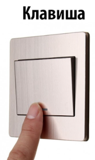

`image_id`: `img_0095`  
Связи:

- `doc_016_chunk_0006_stmt_005 -> img_0095`
- `doc_016_chunk_0006_stmt_006 -> img_0095`

Мастер-выключатель включает или отключает питание 220 В на катушку контактора на клеммы А1 и А2. `safety-review`  
Источник: `doc_016_chunk_0006_stmt_007`

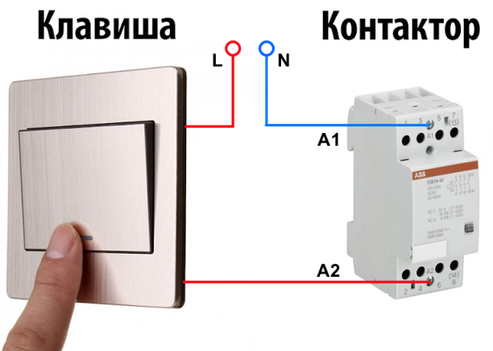

`image_id`: `img_0096`  
Связь: `doc_016_chunk_0006_stmt_007 -> img_0096`

## Контактор

Контакторы являются электромагнитными устройствами, состоящими из катушки управления подвижными силовыми контактами и неподвижных силовых контактов.  
Источник: `doc_016_chunk_0006_stmt_008`

Особое назначение контакторов состоит в дистанционном управлении электрическими сетями и коммутации номинального тока.  
Источник: `doc_016_chunk_0006_stmt_009`

Контактор используется для отключения и подключения элементов электрической цепи.  
Источник: `doc_016_chunk_0006_stmt_010`

Визуальные примеры из исходного документа:

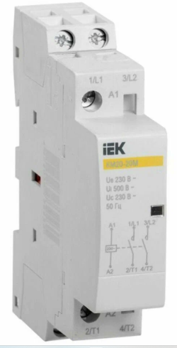

`image_id`: `img_0097`  
Связи:

- `doc_016_chunk_0006_stmt_008 -> img_0097`
- `doc_016_chunk_0006_stmt_009 -> img_0097`
- `doc_016_chunk_0006_stmt_010 -> img_0097`

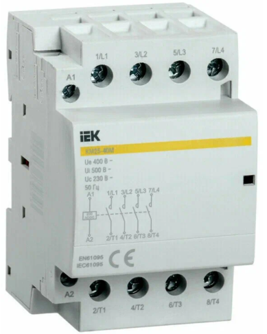

`image_id`: `img_0098`  
Связи:

- `doc_016_chunk_0006_stmt_008 -> img_0098`
- `doc_016_chunk_0006_stmt_009 -> img_0098`
- `doc_016_chunk_0006_stmt_010 -> img_0098`

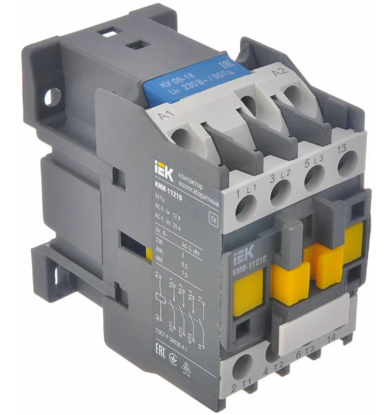

`image_id`: `img_0099`  
Связи:

- `doc_016_chunk_0006_stmt_008 -> img_0099`
- `doc_016_chunk_0006_stmt_009 -> img_0099`
- `doc_016_chunk_0006_stmt_010 -> img_0099`

Конструкция контактора включает подвижный элемент, катушки, пружины и замыкающиеся группы контактов.  
Источник: `doc_016_chunk_0006_stmt_011`

При подаче управляющего напряжения магнитный якорь контактора притягивается к сердечнику и замыкает рабочие контакты. `safety-review`  
Источник: `doc_016_chunk_0006_stmt_012`

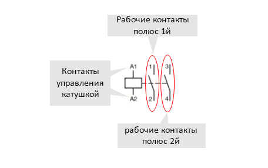

`image_id`: `img_0100`  
Связи:

- `doc_016_chunk_0006_stmt_011 -> img_0100`
- `doc_016_chunk_0006_stmt_012 -> img_0100`

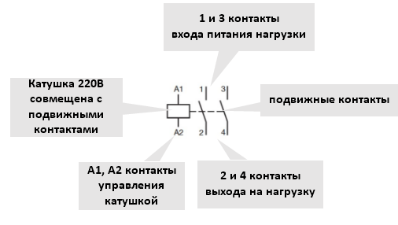

`image_id`: `img_0101`  
Связи:

- `doc_016_chunk_0006_stmt_011 -> img_0101`
- `doc_016_chunk_0006_stmt_012 -> img_0101`

Нормально разомкнутый рабочий контакт в состоянии покоя без питания на катушке разомкнут, а при подаче питания на катушку замыкается.  
Источник: `doc_016_chunk_0007_stmt_001`

Нормально замкнутый рабочий контакт в состоянии покоя без питания на катушке замкнут, а при подаче питания на катушку размыкается.  
Источник: `doc_016_chunk_0007_stmt_002`

Типы контактов указаны на корпусе контактора в виде схемы, и эту информацию нужно учитывать и проверять перед переборкой щита. `safety-review`  
Источник: `doc_016_chunk_0007_stmt_003`

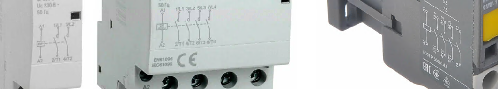

`image_id`: `img_0109`  
Связь: `doc_016_chunk_0007_stmt_003 -> img_0109`

## Мастер-выключатель и контактор

Клавиша мастер-выключателя замыкает или размыкает цепь управления катушкой контактора А1 и А2. `safety-review`  
Источник: `doc_016_chunk_0007_stmt_004`

При появлении или пропадании напряжения на контактах А1 и А2 катушка движется вместе с подвижными контактами и замыкает или размыкает их с неподвижными рабочими контактами 1 и 3, 2 и 4. `safety-review`  
Источник: `doc_016_chunk_0007_stmt_005`

Рабочие контакты контактора, замыкаясь или размыкаясь, подают или отключают питание в управляемую силовую цепь. `safety-review`  
Источник: `doc_016_chunk_0007_stmt_006`

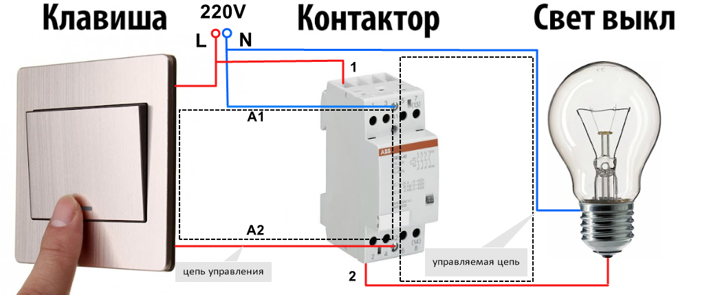

`image_id`: `img_0110`  
Связи:

- `doc_016_chunk_0007_stmt_004 -> img_0110`
- `doc_016_chunk_0007_stmt_005 -> img_0110`
- `doc_016_chunk_0007_stmt_006 -> img_0110`

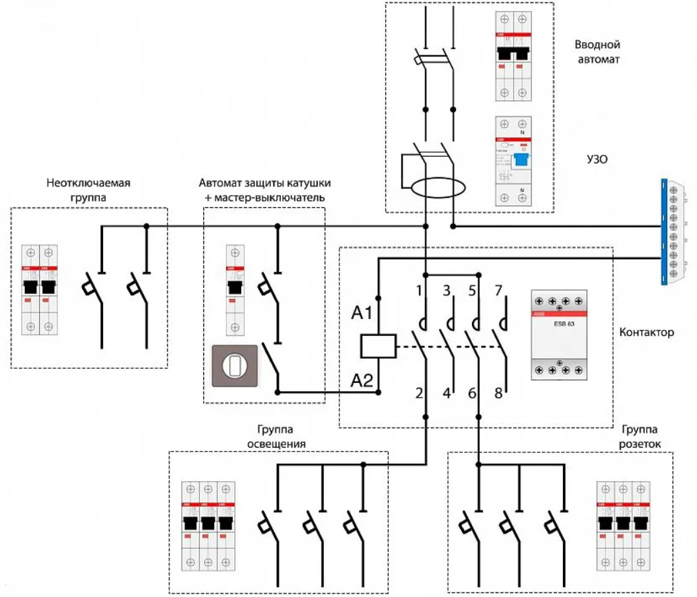

`image_id`: `img_0111`  
Связи:

- `doc_016_chunk_0007_stmt_006 -> img_0111`
- `doc_016_chunk_0007_stmt_007 -> img_0111`
- `doc_016_chunk_0007_stmt_008 -> img_0111`

## Мастер-выключатель и группа резерва

При выделении группы резерва с отключаемыми мастер-выключателем потребителями нужно сохранить принцип `как работало, так и будет работать`. `safety-review`  
Источник: `doc_016_chunk_0007_stmt_007`

При выделении в резерв части отключаемых потребителей нужно сохранить им функцию управления питанием через мастер-выключатель. `safety-review`  
Источник: `doc_016_chunk_0007_stmt_008`

Для сохранения функции мастер-выключателя нужно отделить резервируемую часть отключаемых потребителей от нерезервируемых. `safety-review`  
Источник: `doc_016_chunk_0007_stmt_009`

Для отделения резервируемых и нерезервируемых отключаемых потребителей у контактора обычно доступен один или несколько незадействованных контактов или полюсов. `safety-review`  
Источник: `doc_016_chunk_0007_stmt_010`

Чтобы сохранить работоспособность контактора при пропадании внешней сети, нужно присоединить управляющие контакты А1 и А2 катушки контактора к резервной линии. `safety-review`  
Источник: `doc_016_chunk_0007_stmt_011`

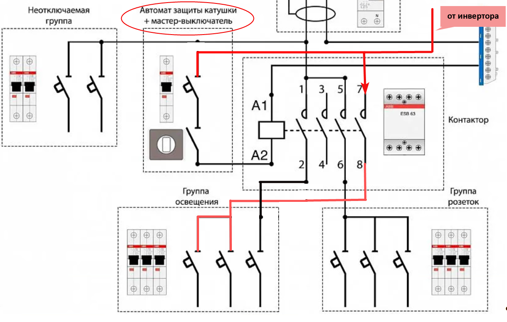

`image_id`: `img_0112`  
Связи:

- `doc_016_chunk_0007_stmt_009 -> img_0112`
- `doc_016_chunk_0007_stmt_010 -> img_0112`
- `doc_016_chunk_0007_stmt_011 -> img_0112`

Мастер-выключатель имеет свой автомат защиты, который нужно определить и запитать от резервной линии. `safety-review`  
Источник: `doc_016_chunk_0008_stmt_001`

## Очередь safety-review по разделу

Перед финальным утверждением раздела нужно проверить:

- вскрытие и разбор логики вводного щита клиента;
- правило движения от источника электропитания к нагрузке;
- все формулировки про фазы и нули `до УЗО` и `после УЗО`;
- PE/N-шины и подключение заземляющих проводников;
- добавление потребителя `до УЗО` или `после УЗО`;
- правило сборки фаз и нулей потребителей резерва под одним УЗО;
- описание работы контактора, А1/А2, рабочих контактов и силовой цепи;
- схему сохранения функции мастер-выключателя при выделении группы резерва.

Связанный файл очереди:

```text
00_input/documents/electricians_knowledge_base/statements/safety_review_queue.md
```

## Открытые вопросы

- Нужно проверить, какие части раздела можно использовать как учебную справку, а какие только как материал для инженера.
- Нужно решить, как формулировать предупреждение про работу с фазами и нулями относительно УЗО.
- Нужно исправить в исходнике опечатки: `цц`, `разомткнутый`, `пере переборкой`, `мастер вылюючателя`, `А1и А2`.
