# Этапы монтажа ИБП

Статус: черновик редакционного раздела на базе canonical-утверждений и утвержденного визуального слоя. Технически критичные пункты требуют review перед использованием как финальной монтажной инструкции.

Источник слоя знаний:

```text
00_input/documents/electricians_knowledge_base/statements/atomic_statements.jsonl
00_input/documents/electricians_knowledge_base/statements/statement_images.jsonl
00_input/documents/electricians_knowledge_base/statements/statement_clusters.json
```

Кластер: `C009` / `installation_process`

Основной исходный документ: `ЭЛК_3_Базовые_знания_Описание_этапов_монтажа_ред1_9.docx`

## Правило использования

Этот раздел можно использовать как черновик учебного материала и основу будущего чек-листа по этапам монтажа ИБП.

Каждый пункт связан с canonical `statement_id`, чтобы можно было вернуться к исходному утверждению и цитате.

Пункты с пометкой `safety-review` требуют экспертной проверки перед включением в финальную инструкцию для монтажников.

Если пункт связан с изображением, рядом указан `image_id`. Изображения не создают новые правила сами по себе, а иллюстрируют текстовые утверждения из источника.

## Сводка

- Canonical-утверждений в разделе: `101`.
- Требуют `safety-review`: `77`.
- Обычные утверждения без safety-флага: `24`.
- Утвержденных `image_id`: `27`.
- Связей `statement_id -> image_id`: `88`.

## Карта этапов

- Общий порядок монтажа: `18` утверждений.
- Схема простой однофазной системы: `10` утверждений.
- Сборка ИБП, АКБ, инвертор и байпас: `28` утверждений.
- Переборка щита и выделение резервной группы: `17` утверждений.
- Пуск, наладка и параметры инвертора: `28` утверждений.

## Визуальный слой

Визуальный слой перенесен из исходного `doc_015` в `./assets/` и связан с canonical-утверждениями в `statement_images.jsonl`. Малый предупреждающий значок `img_0073` не включен как самостоятельное смысловое изображение.

### Простая однофазная система

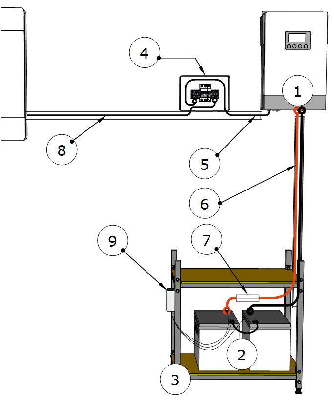

`image_id`: `img_0058`

Связи: `doc_015_chunk_0011_stmt_001` - `doc_015_chunk_0011_stmt_009`.

### Защита по постоянному току

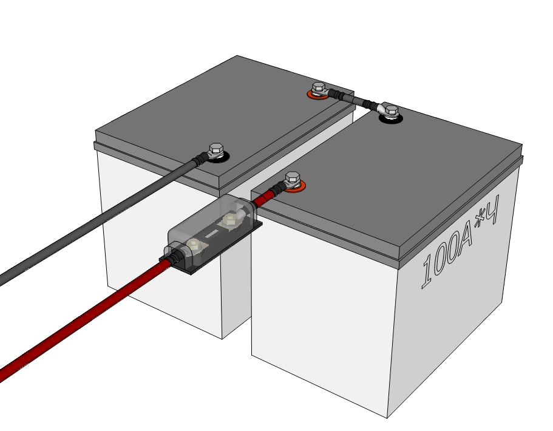

`image_id`: `img_0059`


`image_id`: `img_0060`

### Схемы подключения АКБ

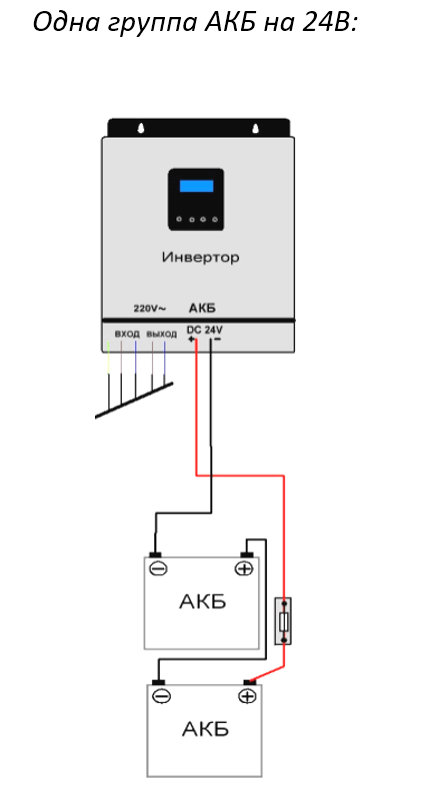

`image_id`: `img_0061`

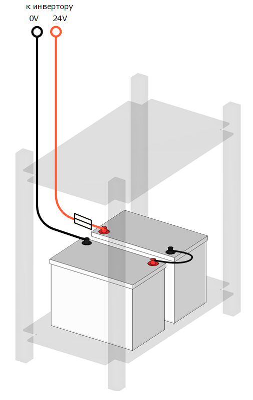

`image_id`: `img_0062`

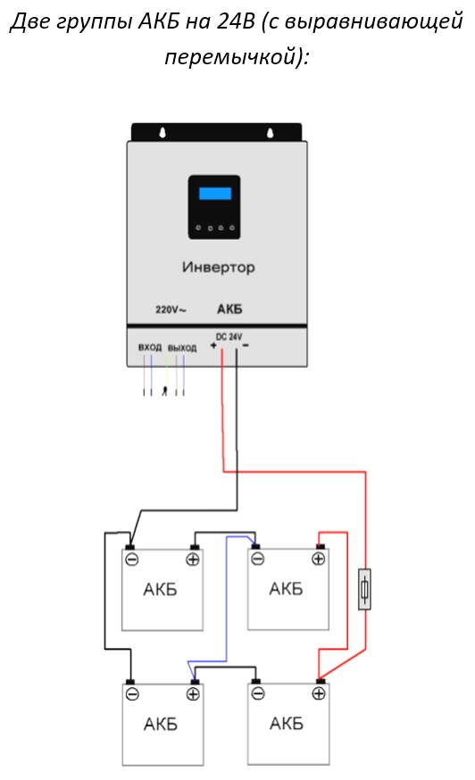

`image_id`: `img_0063`

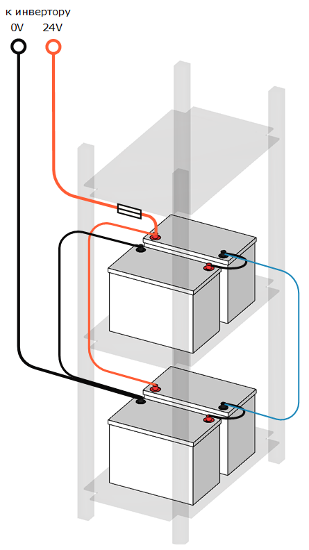

`image_id`: `img_0064`

### Установка инвертора

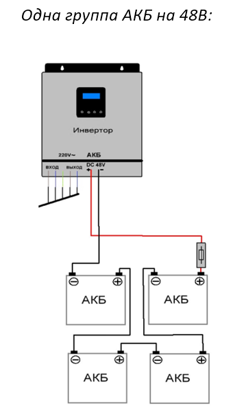

`image_id`: `img_0065`

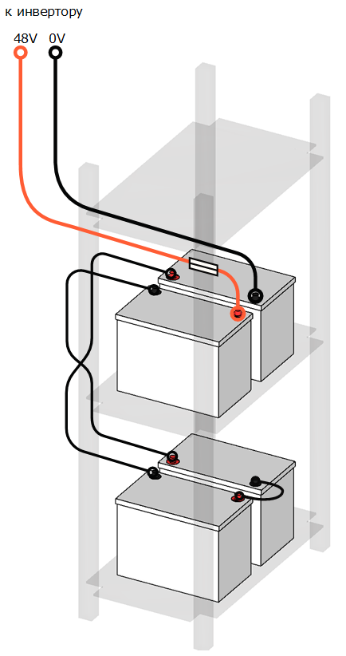

`image_id`: `img_0066`

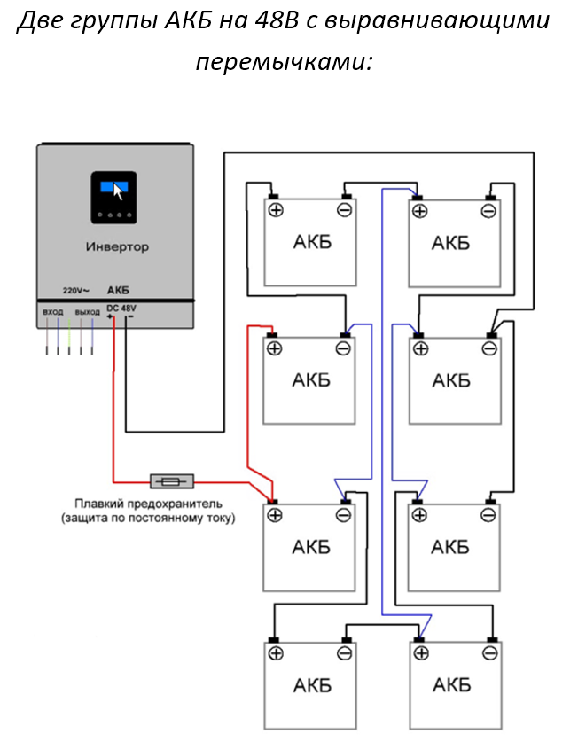

`image_id`: `img_0067`

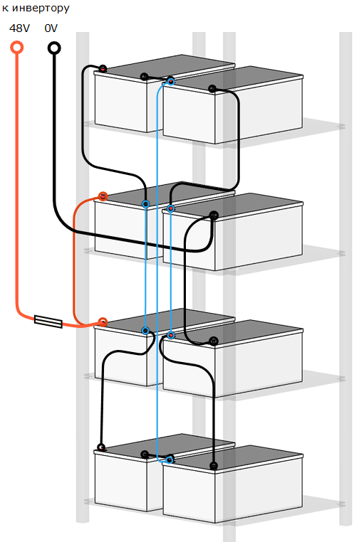

`image_id`: `img_0068`

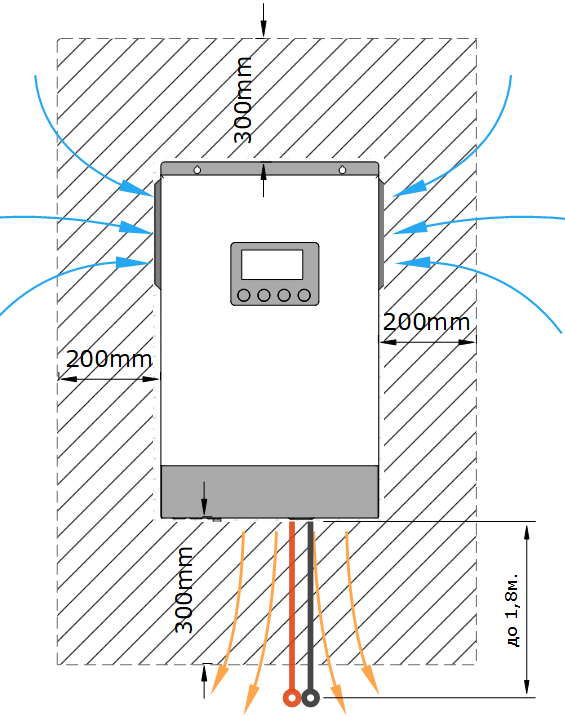

`image_id`: `img_0069`

### Байпасный щит и реверсивная линия

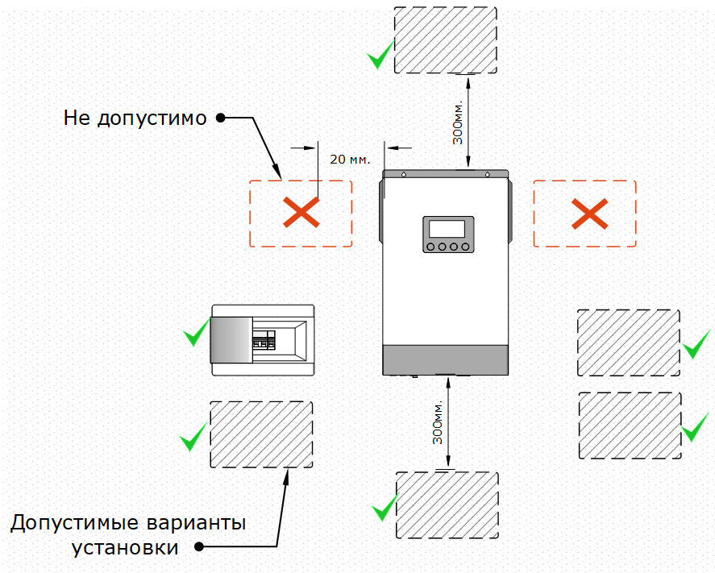

`image_id`: `img_0070`

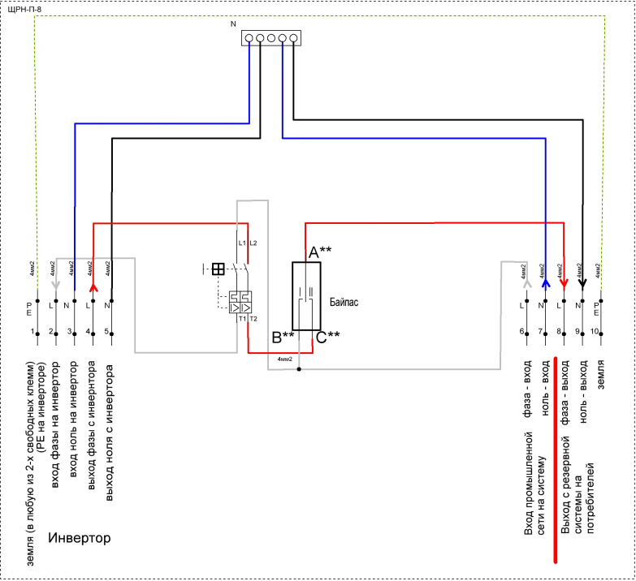

`image_id`: `img_0071`

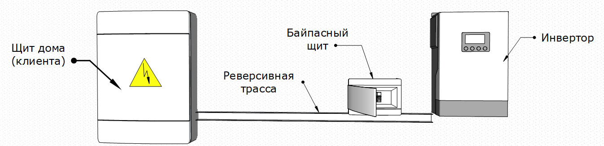

`image_id`: `img_0072`

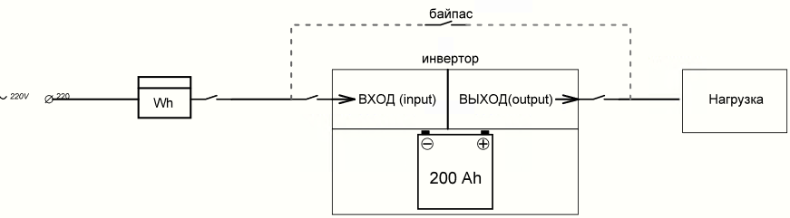

`image_id`: `img_0074`

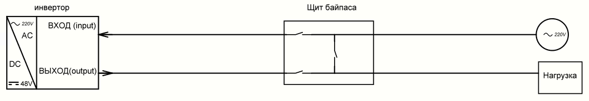

`image_id`: `img_0075`

### Резервная группа

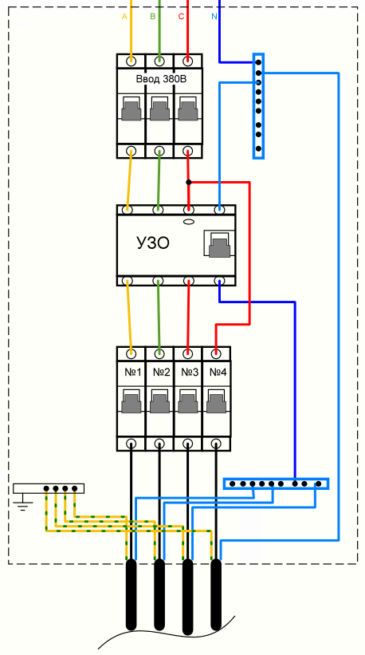

`image_id`: `img_0076`

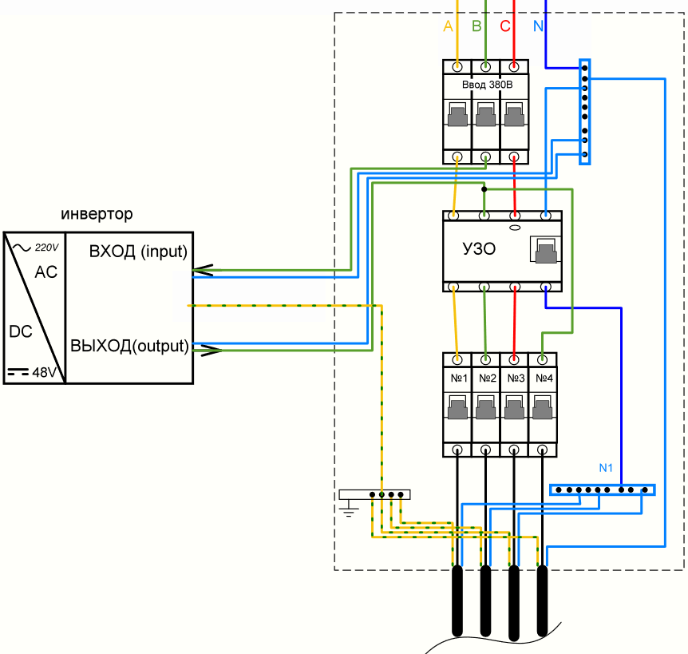

`image_id`: `img_0077`

### Пуск и проверка

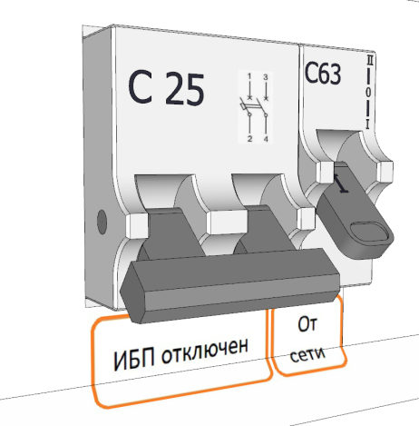

`image_id`: `img_0078`

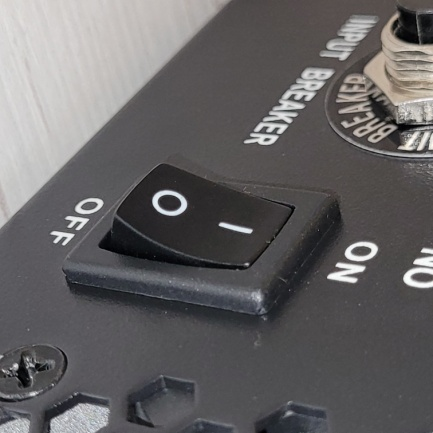

`image_id`: `img_0079`

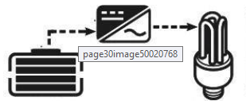

`image_id`: `img_0080`

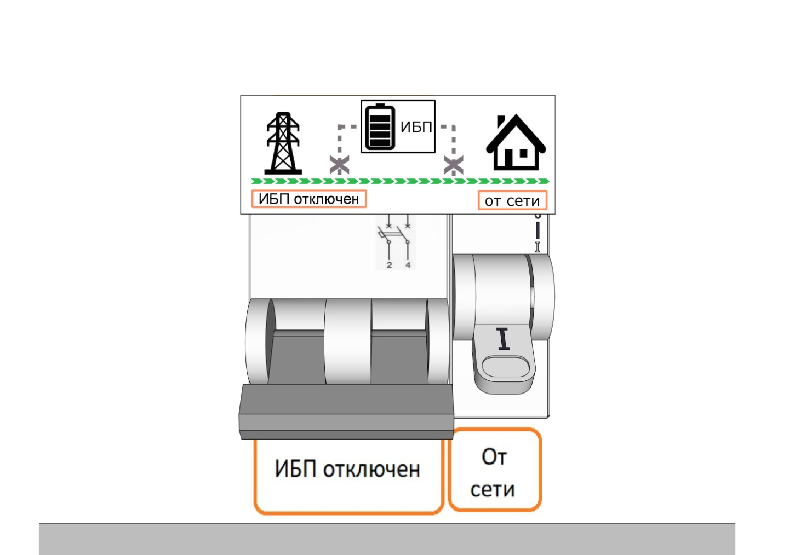

`image_id`: `img_0081`

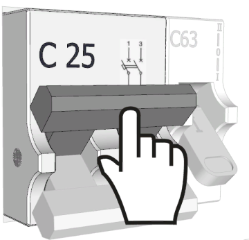

`image_id`: `img_0082`

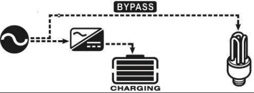

`image_id`: `img_0083`

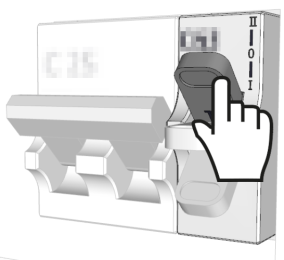

`image_id`: `img_0084`

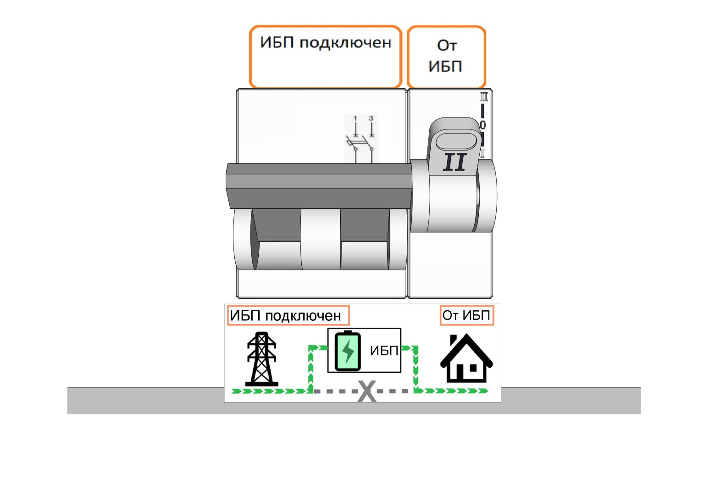

`image_id`: `img_0085`

## Общий порядок монтажа

### Подготовка к монтажу

- На этапе подготовки к монтажу монтажник должен осмотреть места установки ИБП и планируемую прокладку кабеля по техническому заданию.  
  Источник: `doc_015_chunk_0004_stmt_001`.
- При необходимости изменения на этапе подготовки к монтажу должны быть согласованы с клиентом.  
  Источник: `doc_015_chunk_0004_stmt_002`.
- Перед любыми действиями в щите заказчика монтажник должен сделать предварительное фото щита или щитов.  
  Источник: `doc_015_chunk_0004_stmt_003`.
- На этапе подготовки к монтажу монтажник должен проверить соответствие автоматов группы резерва техническому заданию.  
  Источник: `doc_015_chunk_0004_stmt_004`.

### Сборка ИБП

- На этапе сборки ИБП монтажник должен собрать систему, включая стеллаж, аккумуляторы, защитные предохранители, балансиры и другое необходимое оборудование. `safety-review`  
  Источник: `doc_015_chunk_0005_stmt_001`.
- На этапе сборки ИБП монтажник должен установить инвертор, байпасный щит и дополнительную резервную розетку возле ИБП.  
  Источник: `doc_015_chunk_0005_stmt_002`.
- На этапе сборки ИБП монтажник должен смонтировать кабель-трассу от ИБП к щиту заказчика.  
  Источник: `doc_015_chunk_0005_stmt_003`.

### Подключение ИБП к щиту клиента

- При подключении ИБП к щиту клиента монтажник должен выделить группу потребителей, устанавливаемых в резерв, в щите заказчика. `safety-review`  
  Источник: `doc_015_chunk_0006_stmt_001`.

### Настройка ИБП

- На этапе настройки ИБП монтажник должен выполнить настройку параметров работы ИБП, включая ток заряда, работу с генератором и синхронную работу инверторов. `safety-review`  
  Источник: `doc_015_chunk_0007_stmt_001`.
- При необходимости монтажник должен подключить и настроить GSM-розетку или систему мониторинга.  
  Источник: `doc_015_chunk_0007_stmt_002`.

### Проверка работоспособности системы

- Проверка работоспособности системы должна включать тестирование ИБП и проверку автоматического включения при отключении основного источника питания. `safety-review`  
  Источник: `doc_015_chunk_0007_stmt_003`.
- При проверке работоспособности системы нужно проверить, что все требуемые потребители и помещения входят в резервную группу и корректно работают с ИБП при имитации отключения электричества. `safety-review`  
  Источник: `doc_015_chunk_0007_stmt_004`.

### Проверка работоспособности системы после переборки щита

- После переборки щита нужно проверить, что все нерезервные потребители работают, проверяя наличие напряжения на автоматических выключателях, УЗО, реле и других элементах щита клиента. `safety-review`  
  Источник: `doc_015_chunk_0007_stmt_005`.

### Обучение клиента эксплуатации и использованию ИБП

- При обучении клиента нужно объяснить принцип работы системы ИБП, ее элементов и индикации на приборах.  
  Источник: `doc_015_chunk_0008_stmt_001`.
- При обучении клиента нужно продемонстрировать работу системы с имитацией отключения внешней сети. `safety-review`  
  Источник: `doc_015_chunk_0008_stmt_002`.
- При обучении клиента нужно продемонстрировать действия при нештатных ситуациях, перезапуске системы и консервации.  
  Источник: `doc_015_chunk_0008_stmt_003`.
- При обучении клиента нужно передать клиенту инструкции, гарантийные талоны и иные документы.  
  Источник: `doc_015_chunk_0008_stmt_004`.

### Безопасный монтаж и работа ИБП

- Для безопасного монтажа и работы ИБП необходимо соблюдать технические требования и инструкции производителя. `safety-review`  
  Источник: `doc_015_chunk_0009_stmt_001`.

## Схема простой однофазной системы

### Изучение схемы

- Для понимания схемы нужно внимательно изучить ее по принципу протекания токов, мысленно следуя от источника к нагрузке. `safety-review`  
  Источник: `doc_015_chunk_0017_stmt_001`.

### Пример простой однофазной системы на 24 В

- В примере простой однофазной системы на 24 В одним из основных компонентов является инвертор 24 В.  
  Источник: `doc_015_chunk_0011_stmt_001`.
- В примере простой однофазной системы на 24 В одним из основных компонентов является группа из двух АКБ по 12 В. `safety-review`  
  Источник: `doc_015_chunk_0011_stmt_002`.
- В примере простой однофазной системы на 24 В одним из основных компонентов является стеллаж для АКБ.  
  Источник: `doc_015_chunk_0011_stmt_003`.
- В примере простой однофазной системы на 24 В одним из основных компонентов является байпасный щит с соответствующим автоматом защиты цепи по AC. `safety-review`  
  Источник: `doc_015_chunk_0011_stmt_004`.
- В примере простой однофазной системы на 24 В используется соединительный кабель «Инвертор-щит» с 5 жилами и сечением 4 мм2. `safety-review`  
  Источник: `doc_015_chunk_0011_stmt_005`.
- В примере простой однофазной системы на 24 В одним из основных компонентов являются аккумуляторные перемычки для подключения инвертора. `safety-review`  
  Источник: `doc_015_chunk_0011_stmt_006`.
- В примере простой однофазной системы на 24 В одним из основных компонентов является защита по постоянному току. `safety-review`  
  Источник: `doc_015_chunk_0011_stmt_007`.
- В примере простой однофазной системы на 24 В используется кабельная реверсивная трасса с 5-жильным кабелем «байпасный щит - щит клиента». `safety-review`  
  Источник: `doc_015_chunk_0011_stmt_008`.
- В примере простой однофазной системы на 24 В одним из основных компонентов является балансир.  
  Источник: `doc_015_chunk_0011_stmt_009`.

## Сборка ИБП, АКБ, инвертор и байпас

### Монтаж ИБП

- При монтаже ИБП необходимо четко следить за полярностью по постоянному напряжению DC. `safety-review`  
  Источник: `doc_015_chunk_0012_stmt_001`.
- При монтаже ИБП нельзя допускать ошибок при фазировке, то есть при подключении фазного и нулевого проводов по высокому напряжению AC. `safety-review`  
  Источник: `doc_015_chunk_0012_stmt_002`.
- При монтаже ИБП необходимо контролировать подключение входа и выхода. `safety-review`  
  Источник: `doc_015_chunk_0012_stmt_003`.
- При монтаже ИБП необходимо четко контролировать момент затяжки болтовых и винтовых соединений и не допускать их повреждения. `safety-review`  
  Источник: `doc_015_chunk_0012_stmt_004`.
- При монтаже ИБП желательно использовать динамометрическую отвертку.  
  Источник: `doc_015_chunk_0012_stmt_005`.

### Сборка и подключение защиты по постоянному току

- Комплект защиты по постоянному току должен монтироваться к плюсовой клемме АКБ с помощью перемычки 0,1 м сечением 35 мм2. `safety-review`  
  Источник: `doc_015_chunk_0013_stmt_001`. Связанные image_id: `img_0059, img_0060`.
- Плюсовая клемма инвертора подключается к защите по постоянному току кабелем сечением 35 мм2 длиной 1,4-1,8 метра красного цвета. `safety-review`  
  Источник: `doc_015_chunk_0013_stmt_002`. Связанные image_id: `img_0059, img_0060`.

### Установка АКБ

- АКБ устанавливаются на стеллаж или иным способом, указанным в техническом задании на монтаж.  
  Источник: `doc_015_chunk_0014_stmt_001`.
- Группа или группы АКБ собираются согласно номинальному напряжению инвертора: 12 В, 24 В или 48 В. `safety-review`  
  Источник: `doc_015_chunk_0014_stmt_002`. Связанные image_id: `img_0061, img_0062, img_0063, img_0064`.
- При сборке группы или групп АКБ используются перемычки из комплектации по схеме параллельного и последовательного соединения. `safety-review`  
  Источник: `doc_015_chunk_0014_stmt_003`. Связанные image_id: `img_0061, img_0062, img_0063, img_0064`.
- Инвертор имеет вход по постоянному напряжению DC, куда подключаются провода «+» и «-» от банка АКБ. `safety-review`  
  Источник: `doc_015_chunk_0014_stmt_004`. Связанные image_id: `img_0061, img_0062, img_0063, img_0064`.

### Установка инвертора

- При установке инвертора необходимо соблюдать регламент монтажа инвертора и располагать байпасный щит, трассы и другое оборудование с учетом норм допуска и монтажа.  
  Источник: `doc_015_chunk_0014_stmt_005`. Связанные image_id: `img_0065, img_0066, img_0067, img_0068`.
- Инвертор монтируется на стену с помощью крепежа, соответствующего материалу стены.  
  Источник: `doc_015_chunk_0014_stmt_006`. Связанные image_id: `img_0065, img_0066, img_0067, img_0068`.
- Вентиляционные отверстия справа, слева и снизу на корпусе инвертора нельзя перекрывать; минимальный отступ должен составлять 20 см. `safety-review`  
  Источник: `doc_015_chunk_0014_stmt_007`. Связанные image_id: `img_0065, img_0066, img_0067, img_0068`.
- Расстояние от банка АКБ до инвертора должно быть не больше длины DC-проводов из комплектации к системе и не более 1,8 метра без учета защиты по постоянному току. `safety-review`  
  Источник: `doc_015_chunk_0014_stmt_008`. Связанные image_id: `img_0069`.
- При установке инвертора желательно располагать его так, чтобы дальнейшая эксплуатация была удобной и ЖК-дисплей находился на уровне глаз пользователя, если это возможно.  
  Источник: `doc_015_chunk_0014_stmt_009`. Связанные image_id: `img_0065, img_0066, img_0067, img_0068`.
- Требование не перекрывать вентиляционные отверстия и выдерживать минимальный отступ 20 см обусловлено принудительным охлаждением инвертора. `safety-review`  
  Источник: `doc_015_chunk_0014_stmt_010`. Связанные image_id: `img_0065, img_0066, img_0067, img_0068`.

### Установка байпасного щита

- Щит байпаса располагается с учетом норм монтажа инвертора и всегда возле инвертора.  
  Источник: `doc_015_chunk_0015_stmt_001`. Связанные image_id: `img_0070`.
- За редким исключением байпас устанавливается в щите клиента.  
  Источник: `doc_015_chunk_0015_stmt_002`. Связанные image_id: `img_0070`.
- Схему сборки байпасного щита, используемого в монтажах однофазных систем, необходимо изучить и разобраться в ней. `safety-review`  
  Источник: `doc_015_chunk_0015_stmt_003`. Связанные image_id: `img_0071`.
- Инвертор имеет вход AC «ВХОД (input)» для источника переменного тока и выход AC «ВЫХОД (output)» для нагрузки потребителей группы резерва. `safety-review`  
  Источник: `doc_015_chunk_0015_stmt_004`. Связанные image_id: `img_0071`.
- Для простоты восприятия схемы байпасного щита в первую очередь нужно понять принцип работы ИБП и байпаса.  
  Источник: `doc_015_chunk_0015_stmt_005`. Связанные image_id: `img_0071`.

### Прокладка реверсивной кабельной линии

- Подключение реверсивной кабельной линии осуществляется строго последовательно, как показано на рисунке. `safety-review`  
  Источник: `doc_015_chunk_0016_stmt_001`. Связанные image_id: `img_0072`.
- Ни при каких обстоятельствах нельзя допускать соединения или замыкания входа и выхода. `safety-review`  
  Источник: `doc_015_chunk_0016_stmt_002`.
- Для подключения инвертора к байпасному щиту и байпасного щита к щиту клиента используется пятижильный кабель. `safety-review`  
  Источник: `doc_015_chunk_0016_stmt_003`. Связанные image_id: `img_0074`.
- Пятижильный кабель нужен для подачи питания на инвертор по L вход и N вход. `safety-review`  
  Источник: `doc_015_chunk_0016_stmt_004`. Связанные image_id: `img_0074`.
- Пятижильный кабель нужен для возврата питания на потребители группы резерва после инвертора по L выход и N выход. `safety-review`  
  Источник: `doc_015_chunk_0016_stmt_005`. Связанные image_id: `img_0074`.
- После понимания работы байпаса можно разобраться в схеме однофазного и затем трехфазного байпасного щита.  
  Источник: `doc_015_chunk_0016_stmt_006`. Связанные image_id: `img_0075`.

## Переборка щита и выделение резервной группы

### Переборка щита

- Все работы в распределительном щите проводятся строго при отключенном питании щита. `safety-review`  
  Источник: `doc_015_chunk_0018_stmt_001`.
- В процессе переборки щита выполняется перераспределение питания групп потребителей или автоматов. `safety-review`  
  Источник: `doc_015_chunk_0018_stmt_003`.

### Выделение резервной группы

- Выделение резервной группы означает переключение приоритетной нагрузки на питание через ИБП путем изменения схемы подключения в распределительном щите. `safety-review`  
  Источник: `doc_015_chunk_0018_stmt_002`.
- Подключение ИБП должно сохранять безопасность потребителей, находящихся после УЗО. `safety-review`  
  Источник: `doc_015_chunk_0018_stmt_008`. Связанные image_id: `img_0076`.
- Один из вариантов подключения резервной группы - установить отдельное УЗО на резервную группу. `safety-review`  
  Источник: `doc_015_chunk_0018_stmt_009`.
- Один из вариантов подключения резервной группы - использовать существующее УЗО. `safety-review`  
  Источник: `doc_015_chunk_0018_stmt_010`.

### Пример выделения резервной группы

- В примере по техническому заданию нужно выделить в резерв автоматы №2 и №4. `safety-review`  
  Источник: `doc_015_chunk_0018_stmt_004`. Связанные image_id: `img_0076`.
- Для выделения резервной группы нужно изучить схему щита и определить схему распределения с учетом установленных автоматов и УЗО. `safety-review`  
  Источник: `doc_015_chunk_0018_stmt_005`. Связанные image_id: `img_0076`.
- В примерной схеме трехфазное УЗО защищает от утечки потребители на автоматах №1, №2 и №3, стоящих после УЗО. `safety-review`  
  Источник: `doc_015_chunk_0018_stmt_006`. Связанные image_id: `img_0076`.
- В примерной схеме автомат №4 стоит по схеме до УЗО. `safety-review`  
  Источник: `doc_015_chunk_0018_stmt_007`. Связанные image_id: `img_0076`.
- В приведенном примере логичнее использовать существующее УЗО. `safety-review`  
  Источник: `doc_015_chunk_0018_stmt_011`.
- В примере нужно демонтировать перемычку, питающую автомат №4, и перемычку, соединяющую вводной автомат с УЗО по фазе В. `safety-review`  
  Источник: `doc_015_chunk_0018_stmt_012`. Связанные image_id: `img_0077`.
- В примере автомат №4 подключается к выходу инвертора с помощью перемычки и одной из жил пятижильного кабеля. `safety-review`  
  Источник: `doc_015_chunk_0018_stmt_013`. Связанные image_id: `img_0077`.
- В примере подключение автомата №4 к выходу инвертора зажимается в верхней клемме УЗО фазы В до УЗО. `safety-review`  
  Источник: `doc_015_chunk_0018_stmt_014`. Связанные image_id: `img_0077`.
- В примере вход инвертора подключается к вводному автомату снизу к фазе В. `safety-review`  
  Источник: `doc_015_chunk_0018_stmt_015`. Связанные image_id: `img_0077`.
- Нейтральные проводники инвертора подключаются к основному нулю до УЗО. `safety-review`  
  Источник: `doc_015_chunk_0018_stmt_016`. Связанные image_id: `img_0077`.
- После выделения резервной группы в примере питание автоматов №2 и №4 осуществляется через ИБП, автомат №4 переведен с фазы С на фазу В, а автомат №2 остался под защитой УЗО. `safety-review`  
  Источник: `doc_015_chunk_0018_stmt_017`. Связанные image_id: `img_0077`.

## Пуск, наладка и параметры инвертора

### Пуск и наладка ИБП

- Перед запуском инвертора нужно убедиться, что схема группы АКБ собрана правильно и соответствует номиналу инвертора. `safety-review`  
  Источник: `doc_015_chunk_0019_stmt_001`.
- Перед запуском инвертора нужно убедиться, что схема подключения резервной группы корректна: питание, вход инвертора, выход инвертора, нагрузка. `safety-review`  
  Источник: `doc_015_chunk_0019_stmt_002`.
- Перед запуском инвертора нужно убедиться, что подключение реверсивных трасс в байпасном щите соответствует схеме. `safety-review`  
  Источник: `doc_015_chunk_0019_stmt_003`. Связанные image_id: `img_0078`.
- Перед запуском инвертора нужно убедиться, что вход и выход не перепутаны. `safety-review`  
  Источник: `doc_015_chunk_0019_stmt_004`. Связанные image_id: `img_0078`.
- Перед запуском инвертора автоматические выключатели должны находиться в выключенном состоянии. `safety-review`  
  Источник: `doc_015_chunk_0019_stmt_005`. Связанные image_id: `img_0078`.
- Перед запуском инвертора байпас должен находиться в положении от сети. `safety-review`  
  Источник: `doc_015_chunk_0019_stmt_006`. Связанные image_id: `img_0078`.
- Перед запуском инвертора нужно убедиться, что в щите клиента все перемычки и отходящие провода на нагрузку затянуты и держатся крепко. `safety-review`  
  Источник: `doc_015_chunk_0019_stmt_007`. Связанные image_id: `img_0078`.
- Перед запуском инвертора нужно убедиться, что нет межфазных замыканий. `safety-review`  
  Источник: `doc_015_chunk_0019_stmt_008`.
- Запуск системы начинается с включения инвертора, потому что инвертор в режиме ИБП работает от АКБ. `safety-review`  
  Источник: `doc_015_chunk_0019_stmt_009`. Связанные image_id: `img_0079, img_0080, img_0081`.
- Если инвертор работает совместно с литиевой АКБ настенного исполнения, перед включением инвертора нужно включить АКБ. `safety-review`  
  Источник: `doc_015_chunk_0019_stmt_010`. Связанные image_id: `img_0079, img_0080, img_0081`.
- После выполнения настроек система готова к работе.  
  Источник: `doc_015_chunk_0019_stmt_021`. Связанные image_id: `img_0082, img_0083`.
- После выполнения настроек нужно включить автоматический двухполюсный выключатель в байпасном щите, чтобы подать питание на инвертор из сети. `safety-review`  
  Источник: `doc_015_chunk_0019_stmt_022`. Связанные image_id: `img_0082, img_0083`.
- После подачи питания из сети инвертор переключается на сеть и начинает заряжать АКБ установленным током. `safety-review`  
  Источник: `doc_015_chunk_0020_stmt_001`.
- Величину установленного тока заряда АКБ нужно проверять измерительными клещами. `safety-review`  
  Источник: `doc_015_chunk_0020_stmt_002`.
- До переключения байпаса в положение от инвертора нагрузка резервной группы еще питается напрямую от сети. `safety-review`  
  Источник: `doc_015_chunk_0020_stmt_003`.
- Для переключения питания резервной группы на инвертор нужно переключить байпас в положение от инвертора. `safety-review`  
  Источник: `doc_015_chunk_0020_stmt_004`. Связанные image_id: `img_0084, img_0085`.
- Последним этапом наладки системы является проверка работоспособности через отключение вводного автомата и имитацию пропадания внешней сети. `safety-review`  
  Источник: `doc_015_chunk_0020_stmt_005`. Связанные image_id: `img_0084, img_0085`.
- При проверке работоспособности после имитации аварии система должна мгновенно подать питание от АКБ на резервную группу. `safety-review`  
  Источник: `doc_015_chunk_0020_stmt_006`. Связанные image_id: `img_0084, img_0085`.

### Настройка параметров инвертора

- В меню инвертора необходимо установить суммарный зарядный ток от солнца и от сети. `safety-review`  
  Источник: `doc_015_chunk_0019_stmt_011`.
- В меню инвертора необходимо установить ток заряда от сети. `safety-review`  
  Источник: `doc_015_chunk_0019_stmt_012`.
- В меню инвертора необходимо установить тип используемых АКБ. `safety-review`  
  Источник: `doc_015_chunk_0019_stmt_013`.
- В меню инвертора необходимо установить приоритетный источник заряда. `safety-review`  
  Источник: `doc_015_chunk_0019_stmt_014`.
- Если приборов несколько, в меню инвертора необходимо установить параллельный или трехфазный режим согласно документации на конкретный прибор. `safety-review`  
  Источник: `doc_015_chunk_0019_stmt_015`.
- При необходимости в меню инвертора устанавливаются звуковые оповещения.  
  Источник: `doc_015_chunk_0019_stmt_016`.

### Настройка зарядного тока

- Ток заряда выбирается исходя из рекомендованных заводом-изготовителем параметров, в основном из емкости и количества групп АКБ и количества инверторов в системе. `safety-review`  
  Источник: `doc_015_chunk_0019_stmt_017`.
- Чаще всего ток заряда устанавливается по правилу 10% от емкости АКБ. `safety-review`  
  Источник: `doc_015_chunk_0019_stmt_018`.
- Для однофазной системы с одним инвертором и группой из 4 последовательно подключенных AGM-аккумуляторов 200 Ач ток заряда устанавливается 20 А. `safety-review`  
  Источник: `doc_015_chunk_0019_stmt_019`.
- Если с той же группой АКБ используются два параллельно работающих инвертора, суммарный ток заряда 20 А делится на два инвертора и на каждом устанавливается по 10 А. `safety-review`  
  Источник: `doc_015_chunk_0019_stmt_020`.

## Очередь safety-review по разделу

Перед финальным утверждением раздела нужно проверить все пункты с пометкой `safety-review`, особенно:

- полярность DC, подключение АКБ и защиту по постоянному току;
- установку инвертора, вентиляционные отступы и расстояние до банка АКБ;
- байпасный щит и реверсивную кабельную линию;
- запрет соединения или замыкания входа и выхода;
- работы в распределительном щите при отключенном питании;
- перенос фаз и нулей резервных потребителей;
- пуск, проверку напряжений и настройку параметров инвертора;
- зарядный ток АКБ и режимы переключения сети/АКБ.

Связанные файлы очереди:

```text
00_input/documents/electricians_knowledge_base/statements/safety_review_queue.md
00_input/documents/electricians_knowledge_base/statements/safety_review_c009_installation_process.md
```

## Открытые вопросы

- Safety-review пакет для всех `77` safety-critical утверждений подготовлен в `safety_review_c009_installation_process.md`; перед выпуском финальной монтажной инструкции нужен экспертный review по `SR011-SR016`.
- После review можно собрать короткий чек-лист монтажника из этого раздела без потери связей с `statement_id`.
