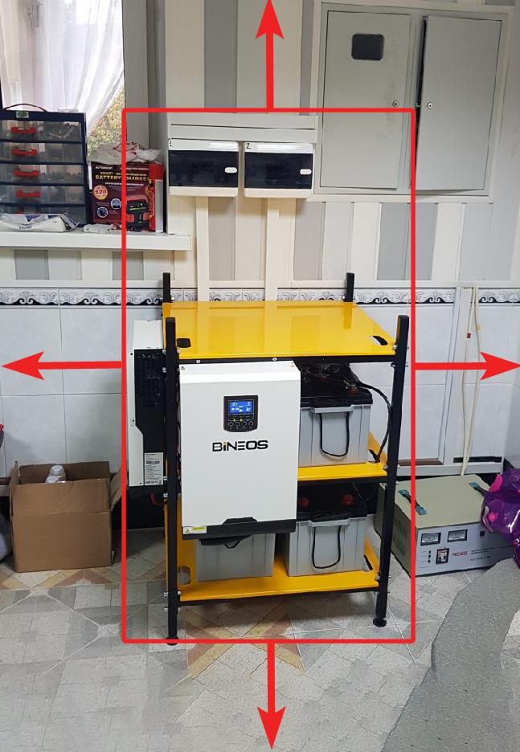
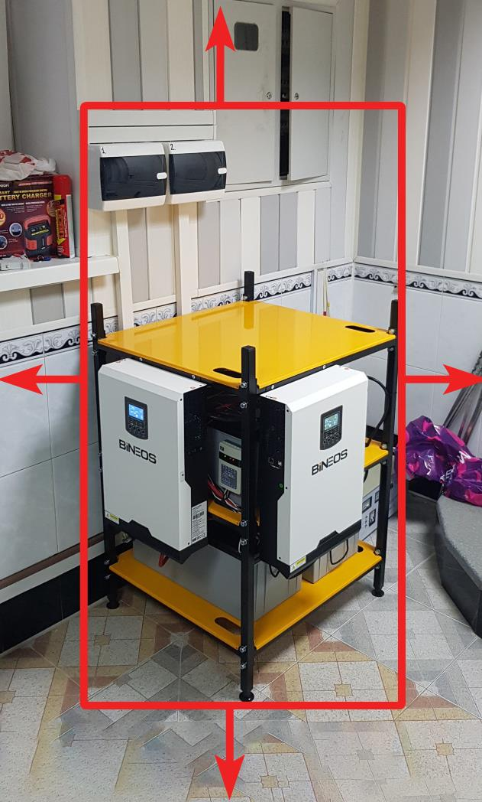

# Фотоотчет и фотофиксация монтажа

Статус: черновик редакционного раздела на базе canonical-утверждений и визуальных примеров из исходного DOCX.

Источник слоя знаний:

```text
00_input/documents/electricians_knowledge_base/statements/atomic_statements.jsonl
00_input/documents/electricians_knowledge_base/statements/statement_images.jsonl
```

Кластер: `C004` / `photo_report`

Основной исходный документ: `Правила_фотосъемки_монтажа_Чек_лист_ред1.docx`

## Правило использования

Этот раздел можно использовать как черновик чек-листа фотоотчета. Пункты с пометкой `safety-review` требуют экспертной проверки перед тем, как включать их в финальную инструкцию для монтажников.

Каждый пункт ниже связан с canonical `statement_id`, чтобы можно было вернуться к исходному утверждению и цитате.

Если пункт связан с изображением, рядом указан `image_id`. Изображения не создают новые правила сами по себе, а иллюстрируют текстовые утверждения из источника.

## Перед монтажом

Фотофиксация перед монтажом используется как обязательная подстраховка.  
Источник: `doc_006_chunk_0002_stmt_001`

Перед началом работ нужно сделать:

- Фото щита заказчика до первого действия с ним; на фото должно быть видно положение каждого автомата. `safety-review`  
  Источник: `doc_006_chunk_0002_stmt_002`
- Фото всех проводов в щите с видимыми местами креплений проводов. `safety-review`  
  Источник: `doc_006_chunk_0002_stmt_003`
- Иные фотографии при наличии дополнительных значимых обстоятельств, например подгорелой проводки.  
  Источник: `doc_006_chunk_0002_stmt_004`

## После монтажа

После монтажа фотоотчет должен содержать 4-6 качественных фото системы с разных ракурсов. Фотографии должны быть четкими и с запасом по бокам, снизу и сверху.  
Источник: `doc_006_chunk_0003_stmt_001`

Визуальные примеры из исходного документа:



`image_id`: `img_0001`  
Связь: `doc_006_chunk_0003_stmt_001 -> img_0001`



`image_id`: `img_0002`  
Связь: `doc_006_chunk_0003_stmt_001 -> img_0002`

## Аккумуляторная сборка

Фотоотчет должен содержать:

- Фото общего вида всех АКБ. `safety-review`  
  Источник: `doc_006_chunk_0004_stmt_001`
- Отдельное фото АКБ на каждой полке стеллажа. `safety-review`  
  Источник: `doc_006_chunk_0004_stmt_002`

## Щит автоматики и элементы системы

Фотоотчет должен содержать:

- Фото щита автоматики после расключения без крышки. `safety-review`  
  Источник: `doc_006_chunk_0005_stmt_001`
- Фото щита автоматики с установленной крышкой и открытой дверцей, чтобы были видны все наклейки на дверце щита. `safety-review`  
  Источник: `doc_006_chunk_0005_stmt_002`
- Фото распаячных коробок, переходных щитов и аналогичных элементов. `safety-review`  
  Источник: `doc_006_chunk_0005_stmt_003`
- Фото включенного балансира или балансиров с видимой индикацией.  
  Источник: `doc_006_chunk_0005_stmt_004`
- Фото установленной GSM-розетки или нескольких розеток.  
  Источник: `doc_006_chunk_0005_stmt_005`

## АТОМ

Если в системе используется АТОМ, фотоотчет должен содержать:

- Скриншот с данными при регистрации нового пользователя.  
  Источник: `doc_006_chunk_0005_stmt_006`
- Скриншоты с показаниями из личного кабинета.  
  Источник: `doc_006_chunk_0005_stmt_007`
- Фото размещения АТОМ.  
  Источник: `doc_006_chunk_0005_stmt_008`

## Инвертор и солнечный контроллер

Фотоотчет должен содержать видео всех настроек инвертора. `safety-review`  
Источник: `doc_006_chunk_0006_stmt_001`

Если видео настроек инвертора записать не удается, фотоотчет должен содержать фотографии всех пунктов меню настройки. `safety-review`  
Источник: `doc_006_chunk_0006_stmt_002`

Также нужно зафиксировать:

- Фото показаний на дисплее инвертора при работе с сетью.  
  Источник: `doc_006_chunk_0006_stmt_003`
- Фото показаний на дисплее инвертора без сети.  
  Источник: `doc_006_chunk_0006_stmt_004`
- Фото показаний на дисплее инвертора по максимальной нагрузке.  
  Источник: `doc_006_chunk_0006_stmt_005`
- Фото подключенного инвертора без нижней планки. `safety-review`  
  Источник: `doc_006_chunk_0006_stmt_006`

## Щит заказчика и кабель-трасса

Фотоотчет должен содержать:

- Фото щита заказчика целиком. `safety-review`  
  Источник: `doc_006_chunk_0007_stmt_001`
- Фото автоматов резерва. `safety-review`  
  Источник: `doc_006_chunk_0007_stmt_002`
- Фото дополнительно установленных автоматов, байпасов, шин, кросс-модулей и аналогичных элементов. `safety-review`  
  Источник: `doc_006_chunk_0007_stmt_003`
- Фото кабель-трассы на всем ее протяжении.  
  Источник: `doc_006_chunk_0007_stmt_004`

## Документы, акты и чеки

Если в акты или иные документы внесены записи, фотоотчет должен содержать фото этого документа.  
Источник: `doc_006_chunk_0008_stmt_001`

После получения чеков через терминал их нужно сфотографировать и отправить в чат `Оплаты на выезде`.  
Источник: `doc_006_chunk_0008_stmt_002`

## Проблемные условия и дополнительные фотографии

Фотоотчет по монтажу должен содержать:

- Фото подгорелой проводки в щите. `safety-review`  
  Источник: `doc_006_chunk_0009_stmt_001`
- Фото батареи рядом с системой, даже если батарея заглушена.  
  Источник: `doc_006_chunk_0009_stmt_002`
- Фото пыльного помещения или помещения, в котором происходит ремонт.  
  Источник: `doc_006_chunk_0009_stmt_003`

## Очередь safety-review по разделу

Перед финальным утверждением раздела нужно проверить пункты:

- фото щита до первого действия;
- фото всех проводов в щите;
- фото АКБ;
- фото щита автоматики;
- фото распаячных коробок и переходных щитов;
- видео или фото настроек инвертора;
- фото подключенного инвертора без нижней планки;
- фото щита заказчика, автоматов резерва и дополнительно установленных элементов;
- фото подгорелой проводки.

Связанный файл очереди:

```text
00_input/documents/electricians_knowledge_base/statements/safety_review_queue.md
```

## Связи и дубли

Связанные требования к щитам, проводам и автоматам сгруппированы в `statement_relations.jsonl` как группа `D007`.

Связанные требования к настройкам и показаниям инвертора сгруппированы как `D008`.

Связанные требования к АТОМ сгруппированы как `D011`.

Эти связи нужны для будущей сборки короткого чек-листа без потери источников.
